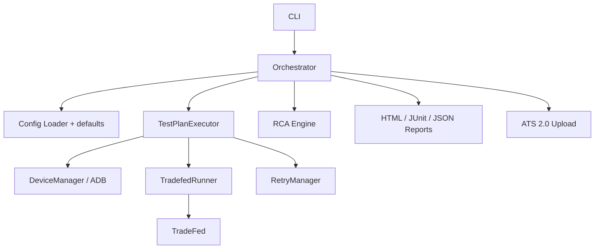

# xTS Agent

The xTS Agent framework for Android Automotive OS (AAOS) test automation.

## Overview
This framework provides tools for orchestrating Android compatibility test suites (CTS, VTS, STS, GTS, ATS, CATBox) via TradeFed, analyzing results, and reporting.

## Features
- TradeFed orchestration with smart retries and sharding
- Device management and health checking
- Modular YAML configuration
- Automated result analysis (RCA)
- Detailed reporting (HTML, JSON, JUnit)

## Architecture



Production path: load plan (merged with `config/default_config.yaml`) → allocate devices → pin serials into TradeFed (`-s`) → parse `test_result.xml` → optional suite retry + RCA → multi-format reports.
## Quick Start
```bash
pip install -e .
xts-agent run --plan basic_plan.yaml
```

## Troubleshooting

### AAPT2 / Build Tools Path Error
If TradeFed fails during the APK preparation phase with `Unable to open 'badging': No such file or directory` or `AaptParser failed`, it means TradeFed cannot find the Android SDK build tools in your environment path.

To resolve this, explicitly export the Android SDK path before executing the agent:
```bash
export ANDROID_HOME=/home/hemang/Android/Sdk
export PATH=$PATH:$ANDROID_HOME/build-tools/34.0.0
export PATH=$PATH:$ANDROID_HOME/platform-tools
```
You can add these lines to your `~/.bashrc` or GitLab CI environment variables to make it persistent.

## 🚀 Native Multi-Device Deployment (For Office/CI Server)

If you are deploying this framework on a fresh office server and need to run **10-device sharded executions**, do **not** rely on complex web-backend NodeJS orchestrators. Instead, use the native AOSP multi-instance spawner included in this repository.

### 1. Start the Cuttlefish Cluster
Use the provided `start_cluster.sh` script to natively spin up 10 Cuttlefish instances. This completely bypasses Docker/Node and interacts directly with the AOSP build system.

```bash
cd /mnt/xTS_Agent/scripts
./start_cluster.sh 10
```
*Note: You can override defaults by exporting `AOSP_ROOT` or `LUNCH_TARGET` before running the script.*

### 2. Verify Devices
Verify that AOSP successfully allocated the virtual ADB ports (typically `0.0.0.0:6520`, `0.0.0.0:6524`, etc.):
```bash
adb devices
```

### 3. Trigger Sharded Validation
Once the devices show up as `device`, run the xTS Agent. The framework will automatically detect all 10 connected instances, allocate them, and pass `--shard-count 10` to TradeFed.

```bash
python3 -m xts_agent.cli run --plan config/test_plans/smoke_test.yaml
```

The 2.5 million tests will instantly load-balance across the cluster, dropping execution time from 5 days to an overnight run!
