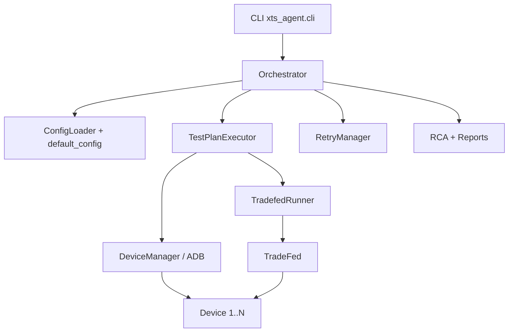

# xTS Agent

xTS Agent runs Android Automotive (AAOS) compatibility suites
(**CTS / VTS / STS / GTS / ATS / CATBox**) through TradeFed.

It discovers ADB devices, shards tests across them, retries failures,
runs light RCA, and writes HTML / JUnit / JSON reports.

---

## Choose your setup

| Mode | When to use | Docker image published? |
|------|-------------|-------------------------|
| **Bare metal (recommended for hardware)** | Real USB/network devices, office rack, CI shell runner | N/A |
| **Docker** | Isolate agent + JDK/SDK tools; devices still on the **host** via ADB | **No** — you **build** from `docker/Dockerfile` |

There is **no pre-built image on Docker Hub**. The repo ships a `Dockerfile` + `docker-compose.yml`; you build locally.

---

## Repository layout

```text
xTS-Agent/
├── xts_agent/                 # Python package (CLI, orchestrator, TradeFed runner)
├── config/
│   ├── default_config.yaml    # Global defaults
│   └── test_plans/            # Runnable plans (smoke, hardware CTS, cert, …)
├── scripts/                   # All supported host scripts (setup, run, monitor)
├── docker/                    # Dockerfile + compose (build locally)
├── results/                   # Generated at runtime (gitignored)
└── tests/                     # Unit tests
```

### Supported scripts (`scripts/`)

| Script | Purpose |
|--------|---------|
| `setup_environment.sh` | One-time host install (JDK, ADB, udev, dirs) |
| `download_xts_packages.sh` | Validate `/opt/xts` suite layout |
| `preflight.sh` | Host pre-flight (aapt2, packages, devices, agent import) |
| `check_ready.sh` | Go/no-go gate before a production run |
| `start_cluster.sh` | Spawn N Cuttlefish instances |
| `run_nightly.sh` | Optional cluster spawn + multi-device plan run |
| `setup_gitlab_runner.sh` | Optional GitLab shell-runner install |

---

## Dependencies

### Always required (host)

| Dependency | Why |
|------------|-----|
| Ubuntu 20.04+ / Debian 11+ | Supported host OS |
| Python **3.8+** (3.10+ recommended; 3.8 is end-of-life) | Agent runtime |
| JDK **17+** | TradeFed |
| **ADB** (platform-tools) | Device discovery / control |
| Android SDK **build-tools** (`aapt2`) | TradeFed APK parsing |
| xTS packages under `/opt/xts` | `cts-tradefed`, etc. |
| 1+ online devices in `adb devices` | Execution targets |

### Python packages

Declared in `pyproject.toml` (`click`, `pyyaml`, `jinja2`, `rich`, `requests`, `xmltodict`, plus the
`postgres` / `s3` / `ai` extras). Deployments install the exact, hash-checked versions in
`requirements.lock` (core + `postgres` + `s3`; one universal lock, tested on Python 3.8 and 3.12):

```bash
pip install --require-hashes -r requirements.lock && pip install --no-deps -e .
```

After changing dependencies, regenerate both locks (the dev lock is the same set plus the `dev` tools):

```bash
uv pip compile pyproject.toml --universal --extra postgres --extra s3 --generate-hashes --python-version 3.8 -o requirements.lock
uv pip compile pyproject.toml --universal --extra postgres --extra s3 --extra dev --generate-hashes --python-version 3.8 -o requirements-dev.lock
```

### Checks (blocking in CI)

The `check` stage runs before anything touches a device, and the pipeline stops if it fails:

```bash
pip install --require-hashes -r requirements-dev.lock && pip install --no-deps -e .
ruff check xts_agent tests      # pyflakes, import order, bugbear, a few correctness rules
mypy                            # config in pyproject.toml
python -m unittest discover -s tests -t .   # or one area: python -m unittest tests.test_triage
```

### Optional

| Dependency | Why |
|------------|-----|
| AOSP + Cuttlefish (`launch_cvd`) | Virtual multi-device farm |
| Docker Engine + Compose v2 | Containerized agent |
| GitLab Runner (shell) | CI on device host |
| OmniLab ATS 2.0 / Slack webhook | Upload / notify (config flags) |

### Expected `/opt/xts` layout

```text
/opt/xts/
├── platform-tools/          # optional if adb already on PATH
├── android-cts/tools/cts-tradefed
├── android-vts/tools/vts-tradefed
├── android-sts/tools/sts-tradefed
├── android-gts/tools/gts-tradefed
├── android-ats/tools/ats-tradefed
└── android-catbox/tools/catbox-tradefed
```

---

## Path A — New machine **without Docker** (hardware)

### A1. Clone + system setup

```bash
git clone https://github.com/hemangpandhi/xTS-Agent.git
cd xTS-Agent
git checkout main

sudo ./scripts/setup_environment.sh
```

### A2. Android SDK (aapt2)

```bash
export ANDROID_HOME="${ANDROID_HOME:-$HOME/Android/Sdk}"
export ANDROID_SDK_ROOT="$ANDROID_HOME"
export PATH="$PATH:$ANDROID_HOME/platform-tools:$ANDROID_HOME/build-tools/34.0.0"
```

### A3. Python agent

```bash
python3 -m venv .venv
source .venv/bin/activate
pip install -U pip
pip install --require-hashes -r requirements.lock   # exact pinned versions
pip install --no-deps -e .
# Optional, for on-prem AI RCA (pulls torch, compiles llama.cpp):
# pip install -e ".[ai]"
```

### A4. Place xTS packages

Download CTS (and others) from source.android.com / partner portal, extract to `/opt/xts`, then:

```bash
REQUIRED_SUITES=cts ./scripts/download_xts_packages.sh
```

### A5. Connect **multiple devices**

**USB:** enable USB debugging on each device → plug in → accept RSA once → `adb devices -l`

**TCP:**
```bash
adb connect 192.168.1.10:5555
adb connect 192.168.1.11:5555
adb devices -l
```

**Cuttlefish:**
```bash
export AOSP_ROOT=/path/to/aosp
export LUNCH_TARGET=aosp_cf_x86_64_phone-userdebug
./scripts/start_cluster.sh 10
adb devices -l
```

### A6. How multi-device execution works

1. Agent lists online ADB devices (`device` state).
2. Allocates up to `sharding.shard_count` (or **`auto`** = all available).
3. Passes each serial to TradeFed as `-s <serial>` and `--shard-count N`.
4. TradeFed load-balances modules across those devices.

One agent process shards across all allocated devices — no per-device wrapper needed.

### A7. Pre-flight + readiness

```bash
source .venv/bin/activate
./scripts/preflight.sh

STRICT_DEVICES=1 MIN_DEVICES=4 REQUIRED_SUITES=cts \
  ./scripts/check_ready.sh
# must print: RESULT: READY
```

### A8. Execute

```bash
source .venv/bin/activate

# Quick sanity
python3 -m xts_agent.cli run \
  --plan config/test_plans/smoke_test.yaml \
  --config config/default_config.yaml

# Hardware CTS across all connected devices
python3 -m xts_agent.cli run \
  --plan config/test_plans/cts_only.yaml \
  --config config/default_config.yaml \
  --auto-retry

# Full AAOS certification
python3 -m xts_agent.cli run \
  --plan config/test_plans/full_certification.yaml \
  --config config/default_config.yaml \
  --auto-retry
```

**Several agents on one host.** Devices are leased host-wide through lock
files in `device.lease_dir` (default `/var/tmp/xts-agent/leases`, or
`XTS_LEASE_DIR`), so concurrent CI jobs or a manual run never share a device;
a busy device's error names the holder (pid, user, CI job). TradeFed inherits
the lease, so devices stay locked while it runs even if the agent is killed.
All agents on a host must use the same lease directory.

**Flaky devices are quarantined.** A device that fails 3 times in a row
(reboot never comes back, or it drops offline during a suite) is skipped for
24 h (`device.quarantine_after_failures` / `quarantine_hours`). List or
release with `xts-agent quarantine [--release SERIAL]`.

**Running suites in parallel.** Set `max_concurrent_suites: N` in a plan (or
`execution.max_concurrent_suites` in defaults). The agent picks one
same-build device pool and splits it across the first N suites in proportion
to their expected device-hours (measured from past runs on this host, else
built-in estimates); every suite gets at least one device and at most its
`max_shards`. When a suite finishes, its devices start the next pending suite.
Validate one concurrent run on your xTS versions before relying on it.

**Resuming an interrupted run.** Progress is checkpointed to
`results/run_state/<plan>.json` after every suite and retry. If the host
reboots or the job is cancelled, rerun the same command with `--resume`:
suites that already passed are skipped, and an interrupted suite continues
from its last TradeFed session with `run retry` (failed + not-executed
modules) on devices running the same build, instead of starting over.

```bash
python3 -m xts_agent.cli run \
  --plan config/test_plans/full_certification.yaml \
  --config config/default_config.yaml \
  --auto-retry --resume
```

Helpers:

```bash
NUM_DEVICES=4 SPAWN_CLUSTER=0 TEST_PLAN=config/test_plans/cts_only.yaml \
  ./scripts/run_nightly.sh   # wait for 4 ADB devices, then run

NUM_DEVICES=10 SPAWN_CLUSTER=1 \
  TEST_PLAN=config/test_plans/dev_cts_hardware_triage.yaml \
  ./scripts/run_nightly.sh
```

---

## Path B — New machine **with Docker**

### Facts

- **No published image** — build from this repo.
- Image includes Ubuntu 24.04, JDK 17, Python agent, checksum-verified Android cmdline-tools + build-tools 34.
- Runs as unprivileged user `xts` (UID/GID 1000; override with `--build-arg XTS_UID=… XTS_GID=…` to match host file ownership).
- Mount host `/opt/xts` and ADB keys; use **`network_mode: host`** so container ADB sees host devices.
- Mount the host `platform-tools` whose adb runs the host adb server at `/host-platform-tools`
  (check with `which adb` on the host). A different adb version in the container restarts the
  host adb server and can break running tests.
- Secrets are passed from the host environment (`XTS_ATS2_API_KEY`, …), never baked into the image.

### Build + run

```bash
docker build -f docker/Dockerfile -t xts-agent:local .

mkdir -p results
docker run --rm --network host \
  -v /opt/xts:/opt/xts:ro \
  -v "$PWD/results":/app/results \
  -v "$HOME/.android":/home/xts/.android:ro \
  -v "$(dirname "$(which adb)")":/host-platform-tools:ro \
  -e XTS_ATS2_API_KEY -e XTS_SLACK_WEBHOOK \
  xts-agent:local \
  python3 -m xts_agent.cli run \
    --plan config/test_plans/cts_only.yaml \
    --config config/default_config.yaml \
    --auto-retry
```

Or Compose (from repo root):

```bash
export XTS_PACKAGES_DIR=/opt/xts
export XTS_RESULTS_DIR="$PWD/results"
export HOST_PLATFORM_TOOLS="$(dirname "$(which adb)")"
docker compose -f docker/docker-compose.yml build
docker compose -f docker/docker-compose.yml run --rm xts-agent \
  python3 -m xts_agent.cli run \
    --plan config/test_plans/cts_only.yaml \
    --config config/default_config.yaml \
    --auto-retry
```

| Need | Recommendation |
|------|----------------|
| Real hardware rack / USB / long cert | **Bare metal** (Path A) |
| Reproducible agent+JDK+SDK toolchain | **Docker** agent; devices on host |
| Cuttlefish | Host CVD + bare metal or Docker agent |

---

## Test plans

| Plan file | Profile | TradeFed plan | Use when |
|-----------|---------|---------------|----------|
| `smoke_test.yaml` | development | `cts` + include filter | First hardware check |
| `cts_only.yaml` | certification | `cts`, `shard_count: auto` | **Hardware multi-device CTS** |
| `full_cts_hardware.yaml` | certification | `cts`, auto shards | Full hardware CTS |
| `dev_cts_hardware_triage.yaml` | development | `cts` minus known-failing modules | Fast nightly/triage iteration |
| `full_certification.yaml` | certification | `cts` (+ VTS/STS/…) | Full AAOS cert |
| `full_cts.yaml` | development | **`cts-virtual-device`** | **Cuttlefish / virtual only** |
| `vts_only.yaml` / `catbox_functional.yaml` | certification | suite-specific | Manual single-suite |

**Profiles.** A plan declares `profile: certification` or `profile: development`
(default). Certification plans must run every module: any `exclude_filters`,
`include_filters` or `modules` subset is rejected at load time, because filtered
results are not valid for submission. Reports are labelled with the profile.
Keep module exclusions in development plans only.

Defaults: `config/default_config.yaml`.

---

## Secrets

Never commit credentials in YAML (the loader warns when a secret-named key
holds a plaintext value). Either reference an environment variable anywhere
in a plan or `default_config.yaml`:

```yaml
ats2:
  api_key: "${XTS_ATS2_API_KEY}"
  base_url: "${ATS2_URL:-https://ats.example.internal}"
```

or set one of these, which always override YAML:

| Variable | Setting |
|----------|---------|
| `XTS_GEMINI_API_KEY` | `ai_rca.gemini_api_key` |
| `XTS_ATS2_API_KEY` | `ats2.api_key` |
| `XTS_SLACK_WEBHOOK` | Slack webhook for notifications |
| `XTS_WIFI_PASSWORD` | Wi-Fi password for device preparation |
| `XTS_JIRA_TOKEN` | Jira PAT (Server/DC) or API token (Cloud) |
| `XTS_DATABASE_URL` | Optional PostgreSQL URL for the shared results database |

In GitLab, store them as **masked + protected** CI/CD variables (or inject
from Vault); on bare metal, export them from a root-owned env file.

## Failure triage and Jira

After every run (and `analyze` / `retry`) the agent groups failures by root-cause
signature and labels each group:

- **History** - `NEW` (passed in earlier runs: a regression, with the last
  passing build), `PERSISTENT`, `FLAKY`, or `NO_HISTORY`.
- **Known issue / waiver** - from `config/known_issues.yaml`. Waivers must
  expire and never change TradeFed results.
- **Owner** - from `config/ownership.yaml` (a starter map: replace the
  placeholder teams/components with yours).

Output: `results/triage/triage_*.json` and a triage table in the HTML report.

```bash
# Seed history from past TradeFed results (oldest first is handled for you)
xts-agent triage --import-history /opt/xts/android-cts/results/2026.10.04_16.16.31.269_4285
# Triage any TradeFed results dir, no agent run needed
xts-agent triage --results-dir /opt/xts/android-cts/results/<session_dir>
```

**Jira.** With `jira.enabled: true`, each actionable group gets one ticket
(labelled `xts-sig-<signature>`); if an open ticket with that label exists the
agent comments on it instead of filing a duplicate. Only `NEW`/`NO_HISTORY`
groups open new tickets, capped by `max_new_issues_per_run`. Start with
`mode: dry_run` (writes `results/triage/jira_preview_*.json`) and import past
results first, otherwise the first run sees every group as `NO_HISTORY`.

## Results database

Run summaries (`suite_runs`), failure history and the AI cache live in SQLite at
`agent.database_path` by default. For several agent hosts sharing history,
point them at one PostgreSQL database:

```bash
pip install -e ".[postgres]"
export XTS_DATABASE_URL="postgresql://xts:<password>@db.lab.example:5432/xts"
```

Tables are created on first use. Credentials are masked in logs.

## AI RCA (on-prem by default)

`ai_rca` defaults to `provider: llama_cpp`, so failure logs, stack traces and
retrieved OEM source never leave the host. External providers (`gemini`) are
refused unless `ai_rca.allow_external_providers: true` is set explicitly —
get your security/legal sign-off before enabling it.

---

## Outputs

| Artifact | Path |
|----------|------|
| HTML / JSON / JUnit | `results/reports/` |
| JUnit (CI) | `results/junit/` |
| TradeFed logs | `results/logs/` |
| RCA | `results/rca/` |
| History DB | `results/xts_agent.db` |

```bash
python3 -m xts_agent.cli report --plan config/test_plans/cts_only.yaml \
  --config config/default_config.yaml --format html,json,junit
python3 -m xts_agent.cli analyze --plan config/test_plans/cts_only.yaml \
  --config config/default_config.yaml --rca --classify-failures
python3 -m xts_agent.cli device-check --min-devices 4
python3 -m xts_agent.cli health-check
python3 -m xts_agent.cli cleanup --kill-tradefed
python3 -m xts_agent.cli cleanup --prune-results --keep-days 14 --dry-run
```

Live progress is in the job log (TradeFed heartbeat every `ops.progress_interval_secs`)
and, when enabled, in Prometheus; see Operations below.

## Operations

All under `ops:` in `config/default_config.yaml` (overridable per plan).

| Concern | Behaviour |
|---------|-----------|
| **Cancel / stop** | SIGTERM or Ctrl-C (CI cancel, `docker stop`, systemd) stops TradeFed so it flushes partial results, skips retries/RCA/uploads, writes the checkpoint and reports, exits 143/130. Continue later with `run --resume`. A second signal force-kills. `cleanup --kill-tradefed` in `after_script` remains the fallback if the agent is SIGKILLed. |
| **Heartbeat** | Every `progress_interval_secs` (600) the job log shows modules finished/started, failures so far and the module on each device; a TradeFed log silent for `stall_warning_mins` (60) is flagged as a likely hang. The same data is written to `results/run_state/<plan>.json`. |
| **Metrics** | `metrics_textfile_dir` (node_exporter textfile collector) and/or `pushgateway_url`. Heartbeat and end-of-run gauges: `xts_run_in_progress`, `xts_run_heartbeat_timestamp_seconds`, `xts_suite_quiet_seconds`, `xts_suite_tests{result}`, `xts_suite_status`, `xts_triage_groups{label}`, `xts_devices_quarantined`, ... |
| **Disk guard** | `run`/`retry` exit 3 if a filesystem they write to (suite packages, results, temp dir) has less than `min_free_disk_gb` (20). |
| **Retention** | TradeFed never deletes results or logs (GBs per CTS session). `cleanup --prune-results --keep-days N [--dry-run]` deletes older sessions, always keeping the newest 3 per suite and sessions an unfinished run can resume from. In CI set `XTS_PRUNE_DAYS`. |
| **Logs** | One console stream (plain timestamped lines in CI, Rich on a terminal) and `logs/xts_agent.log` as JSON, rotated at 50 MB x 5. Every line carries the run id (`XTS_RUN_ID`, in CI the pipeline id) and the suite. |

Suggested alerts: heartbeat older than 2x the interval while `xts_run_in_progress == 1`
(agent or host died); `xts_suite_quiet_seconds > 3600` (TradeFed hung);
`xts_devices_quarantined > 0`.

---

## Architecture



Flow: load plan → allocate devices → pin serials (`-s`) → TradeFed shards →
parse `test_result.xml` → optional retry/RCA → reports.

---

## GitLab CI (optional)

Shell runner on the device host, tag `android-test-host`.  
Stages: setup → health-check → execute → retry → analyze → report.

---

## Troubleshooting

**AAPT2 / AaptParser failed**
```bash
export ANDROID_HOME=/path/to/Android/Sdk
export PATH="$PATH:$ANDROID_HOME/build-tools/34.0.0:$ANDROID_HOME/platform-tools"
./scripts/preflight.sh
```

**Devices missing / unauthorized**
```bash
adb kill-server && adb start-server
adb devices -l
```

**Wrong plan on hardware** — do not use `full_cts.yaml` (`cts-virtual-device`). Use `cts_only.yaml` or `full_cts_hardware.yaml`.
