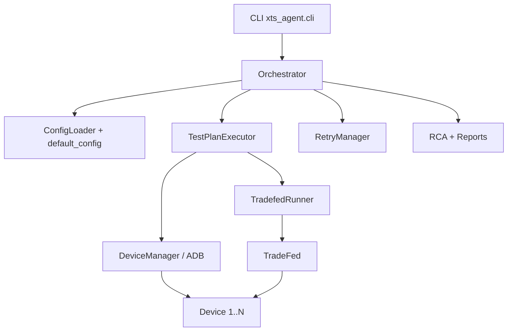

# xTS Agent

xTS Agent runs Android Automotive (AAOS) compatibility suites
(**CTS / VTS / STS / GTS / ATS / CATBox**) through TradeFed.

It discovers ADB devices, shards tests across them, retries failures,
runs light RCA, and writes HTML / JUnit / JSON reports.

---

## Choose your setup

| Mode | When to use | Docker image published? |
|------|-------------|-------------------------|
| **Bare metal (recommended for hardware)** | Real USB/network devices, office rack, CI shell runner | N/A |
| **Docker** | Isolate agent + JDK/SDK tools; devices still on the **host** via ADB | **No** — you **build** from `docker/Dockerfile` |

There is **no pre-built image on Docker Hub**. The repo ships a `Dockerfile` + `docker-compose.yml`; you build locally.

---

## Repository layout

```text
xTS-Agent/
├── xts_agent/                 # Python package (CLI, orchestrator, TradeFed runner)
├── config/
│   ├── default_config.yaml    # Global defaults
│   └── test_plans/            # Runnable plans (smoke, hardware CTS, cert, …)
├── scripts/                   # All supported host scripts (setup, run, monitor)
├── docker/                    # Dockerfile + compose (build locally)
├── monitor_web/               # Optional localhost resource UI
├── results/                   # Generated at runtime (gitignored)
└── tests/                     # Unit tests
```

### Supported scripts (`scripts/`)

| Script | Purpose |
|--------|---------|
| `setup_environment.sh` | One-time host install (JDK, ADB, udev, dirs) |
| `download_xts_packages.sh` | Validate `/opt/xts` suite layout |
| `preflight.sh` | Host pre-flight (aapt2, packages, devices, agent import) |
| `check_ready.sh` | Go/no-go gate before a production run |
| `start_cluster.sh` | Spawn N Cuttlefish instances |
| `run_when_devices_ready.sh` | Wait for N ADB devices, then run a plan |
| `run_nightly.sh` | Optional cluster spawn + multi-device plan run |
| `check_progress.sh` | Live TradeFed progress summary |
| `monitor_resources.sh` | CPU/RAM CSV sampler |
| `setup_gitlab_runner.sh` | Optional GitLab shell-runner install |

---

## Dependencies

### Always required (host)

| Dependency | Why |
|------------|-----|
| Ubuntu 20.04+ / Debian 11+ | Supported host OS |
| Python **3.10+** | Agent runtime |
| JDK **17+** | TradeFed |
| **ADB** (platform-tools) | Device discovery / control |
| Android SDK **build-tools** (`aapt2`) | TradeFed APK parsing |
| xTS packages under `/opt/xts` | `cts-tradefed`, etc. |
| 1+ online devices in `adb devices` | Execution targets |

### Python packages

From `pyproject.toml` / `requirements.txt`: `click`, `pyyaml`, `jinja2`, `rich`, `requests`, `xmltodict`

### Optional

| Dependency | Why |
|------------|-----|
| AOSP + Cuttlefish (`launch_cvd`) | Virtual multi-device farm |
| Docker Engine + Compose v2 | Containerized agent |
| GitLab Runner (shell) | CI on device host |
| OmniLab ATS 2.0 / Slack webhook | Upload / notify (config flags) |

### Expected `/opt/xts` layout

```text
/opt/xts/
├── platform-tools/          # optional if adb already on PATH
├── android-cts/tools/cts-tradefed
├── android-vts/tools/vts-tradefed
├── android-sts/tools/sts-tradefed
├── android-gts/tools/gts-tradefed
├── android-ats/tools/ats-tradefed
└── android-catbox/tools/catbox-tradefed
```

---

## Path A — New machine **without Docker** (hardware)

### A1. Clone + system setup

```bash
git clone https://github.com/hemangpandhi/xTS-Agent.git
cd xTS-Agent
git checkout main

sudo ./scripts/setup_environment.sh
```

### A2. Android SDK (aapt2)

```bash
export ANDROID_HOME="${ANDROID_HOME:-$HOME/Android/Sdk}"
export ANDROID_SDK_ROOT="$ANDROID_HOME"
export PATH="$PATH:$ANDROID_HOME/platform-tools:$ANDROID_HOME/build-tools/34.0.0"
```

### A3. Python agent

```bash
python3 -m venv .venv
source .venv/bin/activate
pip install -U pip
pip install -e .
```

### A4. Place xTS packages

Download CTS (and others) from source.android.com / partner portal, extract to `/opt/xts`, then:

```bash
REQUIRED_SUITES=cts ./scripts/download_xts_packages.sh
```

### A5. Connect **multiple devices**

**USB:** enable USB debugging on each device → plug in → accept RSA once → `adb devices -l`

**TCP:**
```bash
adb connect 192.168.1.10:5555
adb connect 192.168.1.11:5555
adb devices -l
```

**Cuttlefish:**
```bash
export AOSP_ROOT=/path/to/aosp
export LUNCH_TARGET=aosp_cf_x86_64_phone-userdebug
./scripts/start_cluster.sh 10
adb devices -l
```

### A6. How multi-device execution works

1. Agent lists online ADB devices (`device` state).
2. Allocates up to `sharding.shard_count` (or **`auto`** = all available).
3. Passes each serial to TradeFed as `-s <serial>` and `--shard-count N`.
4. TradeFed load-balances modules across those devices.

One agent process shards across all allocated devices — no per-device wrapper needed.

### A7. Pre-flight + readiness

```bash
source .venv/bin/activate
./scripts/preflight.sh

STRICT_DEVICES=1 MIN_DEVICES=4 REQUIRED_SUITES=cts \
  ./scripts/check_ready.sh
# must print: RESULT: READY
```

### A8. Execute

```bash
source .venv/bin/activate

# Quick sanity
python3 -m xts_agent.cli run \
  --plan config/test_plans/smoke_test.yaml \
  --config config/default_config.yaml

# Hardware CTS across all connected devices
python3 -m xts_agent.cli run \
  --plan config/test_plans/cts_only.yaml \
  --config config/default_config.yaml \
  --auto-retry

# Full AAOS certification
python3 -m xts_agent.cli run \
  --plan config/test_plans/full_certification.yaml \
  --config config/default_config.yaml \
  --auto-retry
```

Helpers:

```bash
MIN_DEVICES=4 TEST_PLAN=config/test_plans/cts_only.yaml \
  ./scripts/run_when_devices_ready.sh

NUM_DEVICES=10 SPAWN_CLUSTER=1 \
  TEST_PLAN=config/test_plans/dev_cts_hardware_triage.yaml \
  ./scripts/run_nightly.sh
```

---

## Path B — New machine **with Docker**

### Facts

- **No published image** — build from this repo.
- Image includes Ubuntu 24.04, JDK 17, Python agent, Android cmdline-tools + build-tools 34.
- Mount host `/opt/xts` and ADB keys; use **`network_mode: host`** so container ADB sees host devices.

### Build + run

```bash
docker build -f docker/Dockerfile -t xts-agent:local .

mkdir -p results
docker run --rm --network host \
  -v /opt/xts:/opt/xts:ro \
  -v "$PWD/results":/app/results \
  -v "$HOME/.android":/root/.android:ro \
  xts-agent:local \
  python3 -m xts_agent.cli run \
    --plan config/test_plans/cts_only.yaml \
    --config config/default_config.yaml \
    --auto-retry
```

Or Compose (from repo root):

```bash
export XTS_PACKAGES_DIR=/opt/xts
export XTS_RESULTS_DIR="$PWD/results"
docker compose -f docker/docker-compose.yml build
docker compose -f docker/docker-compose.yml run --rm xts-agent \
  python3 -m xts_agent.cli run \
    --plan config/test_plans/cts_only.yaml \
    --config config/default_config.yaml \
    --auto-retry
```

| Need | Recommendation |
|------|----------------|
| Real hardware rack / USB / long cert | **Bare metal** (Path A) |
| Reproducible agent+JDK+SDK toolchain | **Docker** agent; devices on host |
| Cuttlefish | Host CVD + bare metal or Docker agent |

---

## Test plans

| Plan file | Profile | TradeFed plan | Use when |
|-----------|---------|---------------|----------|
| `smoke_test.yaml` | development | `cts` + include filter | First hardware check |
| `cts_only.yaml` | certification | `cts`, `shard_count: auto` | **Hardware multi-device CTS** |
| `full_cts_hardware.yaml` | certification | `cts`, auto shards | Full hardware CTS |
| `dev_cts_hardware_triage.yaml` | development | `cts` minus known-failing modules | Fast nightly/triage iteration |
| `full_certification.yaml` | certification | `cts` (+ VTS/STS/…) | Full AAOS cert |
| `full_cts.yaml` | development | **`cts-virtual-device`** | **Cuttlefish / virtual only** |
| `vts_only.yaml` / `catbox_functional.yaml` | certification | suite-specific | Manual single-suite |

**Profiles.** A plan declares `profile: certification` or `profile: development`
(default). Certification plans must run every module: any `exclude_filters`,
`include_filters` or `modules` subset is rejected at load time, because filtered
results are not valid for submission. Reports are labelled with the profile.
Keep module exclusions in development plans only.

Defaults: `config/default_config.yaml`.

---

## Outputs

| Artifact | Path |
|----------|------|
| HTML / JSON / JUnit | `results/reports/` |
| JUnit (CI) | `results/junit/` |
| TradeFed logs | `results/logs/` |
| RCA | `results/rca/` |
| History DB | `results/xts_agent.db` |

```bash
python3 -m xts_agent.cli report --plan config/test_plans/cts_only.yaml \
  --config config/default_config.yaml --format html,json,junit
python3 -m xts_agent.cli analyze --plan config/test_plans/cts_only.yaml \
  --config config/default_config.yaml --rca --classify-failures
python3 -m xts_agent.cli device-check --min-devices 4
python3 -m xts_agent.cli health-check
python3 -m xts_agent.cli cleanup --kill-tradefed
```

Live helpers:

```bash
./scripts/check_progress.sh
./scripts/monitor_resources.sh
./monitor_web/start_web_monitor.sh   # http://127.0.0.1:8585
```

---

## Architecture



Flow: load plan → allocate devices → pin serials (`-s`) → TradeFed shards →
parse `test_result.xml` → optional retry/RCA → reports.

---

## GitLab CI (optional)

Shell runner on the device host, tag `android-test-host`.  
Stages: setup → health-check → execute → retry → analyze → report.

---

## Troubleshooting

**AAPT2 / AaptParser failed**
```bash
export ANDROID_HOME=/path/to/Android/Sdk
export PATH="$PATH:$ANDROID_HOME/build-tools/34.0.0:$ANDROID_HOME/platform-tools"
./scripts/preflight.sh
```

**Devices missing / unauthorized**
```bash
adb kill-server && adb start-server
adb devices -l
```

**Wrong plan on hardware** — do not use `full_cts.yaml` (`cts-virtual-device`). Use `cts_only.yaml` or `full_cts_hardware.yaml`.
