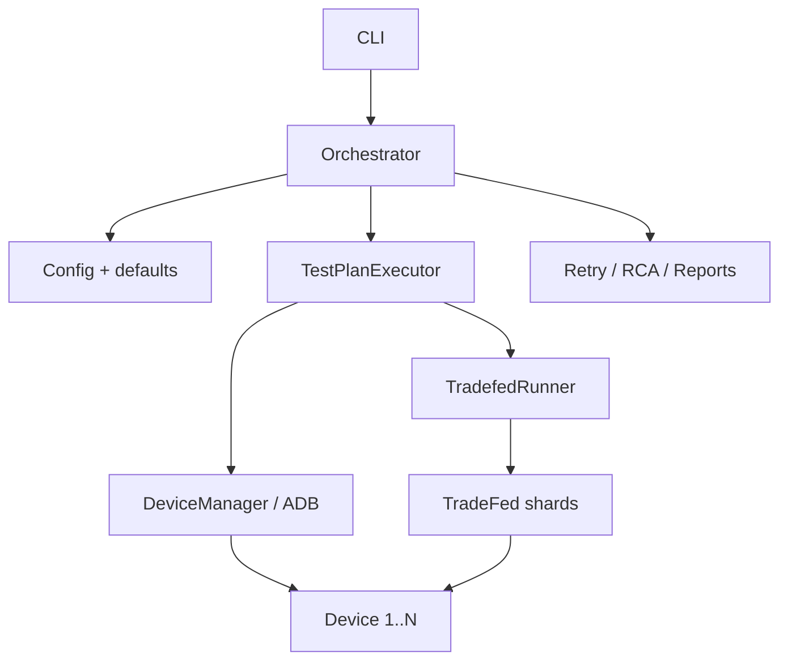

# xTS Agent

xTS Agent runs Android Automotive (AAOS) compatibility suites
(**CTS / VTS / STS / GTS / ATS / CATBox**) through TradeFed.

It discovers ADB devices, shards tests across them, retries failures,
runs light RCA, and writes HTML / JUnit / JSON reports.

---

## Choose your setup

| Mode | When to use | Docker image published? |
|------|-------------|-------------------------|
| **Bare metal (recommended for hardware)** | Real USB/network devices, office rack, CI shell runner | N/A |
| **Docker** | Isolate agent + JDK/SDK tools; devices still on the **host** via ADB | **No** — you **build** from `docker/Dockerfile` |

There is **no pre-built image on Docker Hub**. The repo ships a `Dockerfile` + `docker-compose.yml`; you build locally.

---

## Dependencies

### Always required (host)

| Dependency | Why |
|------------|-----|
| Ubuntu 20.04+ / Debian 11+ | Supported host OS |
| Python **3.10+** | Agent runtime |
| JDK **17+** | TradeFed |
| **ADB** (platform-tools) | Device discovery / control |
| Android SDK **build-tools** (`aapt2`) | TradeFed APK parsing |
| xTS packages under `/opt/xts` | `cts-tradefed`, etc. |
| 1+ online devices in `adb devices` | Execution targets |

### Python packages (from `pyproject.toml` / `requirements.txt`)

`click`, `pyyaml`, `jinja2`, `rich`, `requests`, `xmltodict`

### Optional

| Dependency | Why |
|------------|-----|
| AOSP + Cuttlefish (`launch_cvd`) | Virtual multi-device farm |
| Docker Engine + Compose v2 | Containerized agent |
| GitLab Runner (shell) | CI on device host |
| OmniLab ATS 2.0 / Slack webhook | Upload / notify (config flags) |

### Expected `/opt/xts` layout

```text
/opt/xts/
├── platform-tools/          # optional if adb already on PATH
├── android-cts/tools/cts-tradefed
├── android-vts/tools/vts-tradefed
├── android-sts/tools/sts-tradefed
├── android-gts/tools/gts-tradefed
├── android-ats/tools/ats-tradefed
└── android-catbox/tools/catbox-tradefed
```

---

## Path A — New machine **without Docker** (hardware)

### A1. Install OS packages + ADB helpers

```bash
git clone https://github.com/hemangpandhi/xTS-Agent.git
cd xTS-Agent
git checkout main

sudo ./scripts/setup_environment.sh
```

This installs JDK 17, Python venv tools, platform-tools under `/opt/xts`, and USB udev rules.

### A2. Android SDK (aapt2)

```bash
# Example — adjust to your SDK install
export ANDROID_HOME="${ANDROID_HOME:-$HOME/Android/Sdk}"
export ANDROID_SDK_ROOT="$ANDROID_HOME"
export PATH="$PATH:$ANDROID_HOME/platform-tools:$ANDROID_HOME/build-tools/34.0.0"

# Persist in ~/.bashrc if desired
```

### A3. Python agent

```bash
python3 -m venv .venv
source .venv/bin/activate
pip install -U pip
pip install -e .
```

### A4. Place xTS packages

Download CTS (and others) from source.android.com / partner portal, extract to `/opt/xts`, then:

```bash
REQUIRED_SUITES=cts ./scripts/download_xts_packages.sh
# add ,vts,sts,... as you install more suites
```

### A5. Connect **multiple devices**

#### Option 1 — Physical USB

1. Enable **Developer options → USB debugging** on each device.
2. Plug into the host (powered hub OK).
3. Accept the RSA prompt on each device once.
4. Verify:

```bash
adb devices -l
# expect N lines with status "device"
```

#### Option 2 — Network / TCP ADB

```bash
adb connect 192.168.1.10:5555
adb connect 192.168.1.11:5555
adb devices -l
```

#### Option 3 — Cuttlefish virtual cluster

```bash
export AOSP_ROOT=/path/to/aosp
export LUNCH_TARGET=aosp_cf_x86_64_phone-userdebug   # or AAOS lunch
./scripts/start_cluster.sh 10
adb devices -l
# typical ports: 0.0.0.0:6520, 6524, 6528, ...
```

### A6. How multi-device execution works

1. Agent lists online ADB devices (`device` state).
2. Allocates up to `sharding.shard_count` (or **`auto`** = all available, capped by config).
3. Passes each serial to TradeFed as `-s <serial>` and sets `--shard-count N`.
4. TradeFed load-balances modules across those devices.

You do **not** need one process per device — one agent run shards across all allocated devices.

### A7. Pre-flight

```bash
source .venv/bin/activate
./office_deploy.sh

STRICT_DEVICES=1 MIN_DEVICES=4 REQUIRED_SUITES=cts \
  ./scripts/check_production_ready.sh
# must print: RESULT: READY
```

### A8. Execute

```bash
source .venv/bin/activate

# Quick sanity (1 module filter)
python3 -m xts_agent.cli run \
  --plan config/test_plans/smoke_test.yaml \
  --config config/default_config.yaml

# Hardware CTS across all connected devices
python3 -m xts_agent.cli run \
  --plan config/test_plans/cts_only.yaml \
  --config config/default_config.yaml \
  --auto-retry

# Full AAOS certification (all suites)
python3 -m xts_agent.cli run \
  --plan config/test_plans/full_certification.yaml \
  --config config/default_config.yaml \
  --auto-retry
```

Wait-for-devices helper:

```bash
MIN_DEVICES=4 TEST_PLAN=config/test_plans/cts_only.yaml ./run_when_ready.sh
```

---

## Path B — New machine **with Docker**

### Important facts

- **No published image** — build from this repo.
- Container includes: Ubuntu 24.04, JDK 17, Python agent, Android cmdline-tools + build-tools 34 + platform-tools.
- Container does **not** include `/opt/xts` suites (mount them) or physical USB by itself.
- Compose uses **`network_mode: host`** so the container’s `adb` sees the **same** devices as the host.
- Prefer connecting devices on the **host** (`adb devices` works on host), then run the agent in Docker.

### B1. Host still needs

- Docker Engine + Compose plugin  
- Host ADB with devices online (`adb devices`)  
- xTS packages on host at `/opt/xts`  
- `~/.android` ADB keys (mounted read-only into the container)

```bash
# On host
adb devices -l
ls /opt/xts/android-cts/tools/cts-tradefed
```

### B2. Build image (from repo root)

```bash
git clone https://github.com/hemangpandhi/xTS-Agent.git
cd xTS-Agent
git checkout main

docker build -f docker/Dockerfile -t xts-agent:local .
# or:
docker compose -f docker/docker-compose.yml build
```

### B3. Run with Compose

```bash
mkdir -p results
export XTS_PACKAGES_DIR=/opt/xts
export XTS_RESULTS_DIR="$PWD/results"
export ANDROID_HOST_KEYS="$HOME/.android"

docker compose -f docker/docker-compose.yml up --abort-on-container-exit
```

Default CMD runs `full_cts.yaml` (virtual-oriented). For **hardware**, override:

```bash
docker compose -f docker/docker-compose.yml run --rm xts-agent \
  python3 -m xts_agent.cli run \
    --plan config/test_plans/cts_only.yaml \
    --config config/default_config.yaml \
    --auto-retry
```

### B4. Equivalent `docker run`

```bash
docker run --rm --network host \
  -v /opt/xts:/opt/xts:ro \
  -v "$PWD/results":/app/results \
  -v "$HOME/.android":/root/.android:ro \
  xts-agent:local \
  python3 -m xts_agent.cli run \
    --plan config/test_plans/cts_only.yaml \
    --config config/default_config.yaml \
    --auto-retry
```

### Docker vs bare metal — quick pick

| Need | Recommendation |
|------|----------------|
| Real hardware rack / USB / long cert runs | **Bare metal** (Path A) |
| Reproducible agent+JDK+SDK toolchain | **Docker** for the agent; devices on host |
| Cuttlefish on same host | Bare metal agent **or** Docker agent + host CVD; don’t put CVD inside this image |

---

## Test plans (which file to use)

| Plan file | TradeFed plan | Use when |
|-----------|---------------|----------|
| `smoke_test.yaml` | `cts` + include filter | First hardware check |
| `cts_only.yaml` | `cts`, `shard_count: auto` | **Hardware / multi-device CTS** |
| `full_cts_hardware.yaml` | `cts`, `shard_count: auto` | Full hardware CTS (excludes a few modules) |
| `full_certification.yaml` | `cts` (+ VTS/STS/…) | Full AAOS cert |
| `full_cts.yaml` | **`cts-virtual-device`**, fixed shards | **Cuttlefish / virtual only** — not for hardware |
| `vts_only.yaml` / `catbox_functional.yaml` | suite-specific | Manual single-suite jobs |

Defaults: `config/default_config.yaml`.

---

## Outputs

| Artifact | Path |
|----------|------|
| HTML / JSON / JUnit | `results/reports/` |
| JUnit (CI) | `results/junit/` |
| TradeFed logs | `results/logs/` |
| RCA | `results/rca/` |
| History DB | `results/xts_agent.db` |

```bash
python3 -m xts_agent.cli report --plan config/test_plans/cts_only.yaml \
  --config config/default_config.yaml --format html,json,junit

python3 -m xts_agent.cli analyze --plan config/test_plans/cts_only.yaml \
  --config config/default_config.yaml --rca --classify-failures

python3 -m xts_agent.cli device-check --min-devices 4
python3 -m xts_agent.cli health-check
python3 -m xts_agent.cli cleanup --kill-tradefed
```

---

## Architecture



---

## GitLab CI (optional)

Shell runner on the device host, tag `android-test-host`.  
Stages: setup → health-check → execute → retry → analyze → report.

---

## Troubleshooting

**AAPT2 / AaptParser failed**

```bash
export ANDROID_HOME=/path/to/Android/Sdk
export PATH="$PATH:$ANDROID_HOME/build-tools/34.0.0:$ANDROID_HOME/platform-tools"
./office_deploy.sh
```

**Devices missing / unauthorized**

```bash
adb kill-server && adb start-server
adb devices -l
# unplug/replug; accept RSA on device
```

**Wrong plan on hardware** — do not use `full_cts.yaml` (`cts-virtual-device`). Use `cts_only.yaml` or `full_certification.yaml`.

**Progress during long runs**

```bash
./check_progress.sh
./monitor_resources.sh
./monitor_web/start_web_monitor.sh   # http://127.0.0.1:8585
```

---

## Do not run in production

`scripts/legacy/dev_patches/` — old one-shot mutators. Not part of deploy.
