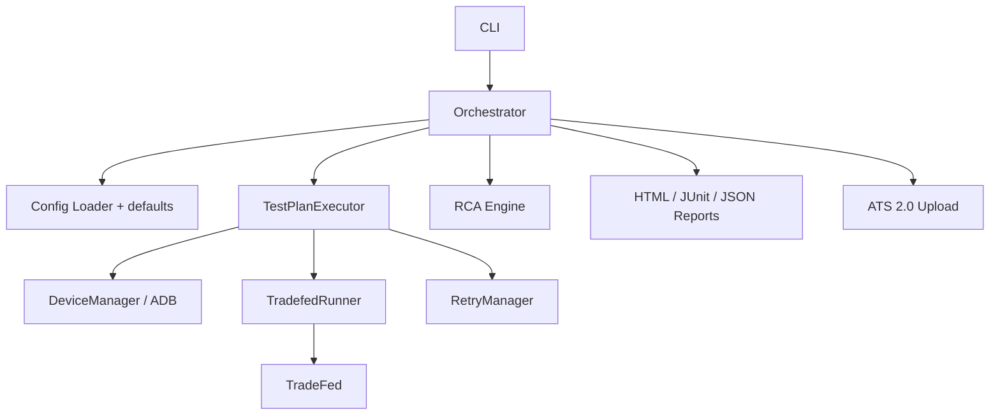

# xTS Agent

xTS Agent orchestrates Android Automotive OS (AAOS) compatibility suites
(CTS, VTS, STS, GTS, ATS, CATBox) via TradeFed, with device allocation,
sharding, retries, RCA, and HTML/JUnit/JSON reports.

## Prerequisites (test host)

| Requirement | Notes |
|-------------|--------|
| OS | Ubuntu 20.04+ / Debian 11+ |
| Python | 3.10+ |
| Java | JDK 17+ |
| ADB | In `PATH` (Platform Tools) |
| Android SDK | `ANDROID_HOME` with `build-tools` (for `aapt2`) |
| xTS packages | Under `/opt/xts/android-<suite>/` |
| Devices | Physical AAOS / emulators / Cuttlefish online in `adb devices` |

Expected package layout:

```text
/opt/xts/
├── android-cts/tools/cts-tradefed
├── android-vts/tools/vts-tradefed
├── android-sts/tools/sts-tradefed
├── android-gts/tools/gts-tradefed
├── android-ats/tools/ats-tradefed
└── android-catbox/tools/catbox-tradefed
```

## 1) Clone and install (one-time)

```bash
git clone <your-repo-url> xTS-Agent
cd xTS-Agent

# System deps + ADB helpers (needs sudo)
sudo ./scripts/setup_environment.sh

# Python package
python3 -m venv .venv
source .venv/bin/activate
pip install -U pip
pip install -e .
```

Export SDK paths (adjust to your machine):

```bash
export ANDROID_HOME="${ANDROID_HOME:-$HOME/Android/Sdk}"
export ANDROID_SDK_ROOT="$ANDROID_HOME"
export PATH="$PATH:$ANDROID_HOME/platform-tools:$ANDROID_HOME/build-tools/34.0.0"
```

## 2) Install / validate xTS packages

Packages are usually downloaded manually (partner portal / source.android.com)
and extracted under `/opt/xts`. Then validate:

```bash
REQUIRED_SUITES=cts,vts ./scripts/download_xts_packages.sh
```

Exit code `0` means required suites (and their `*-tradefed` scripts) are present.

## 3) Connect devices

Physical / network ADB:

```bash
adb devices -l
```

Or spawn a Cuttlefish cluster:

```bash
export AOSP_ROOT=/path/to/aosp
export LUNCH_TARGET=aosp_cf_x86_64_phone-userdebug   # or your AAOS lunch
./scripts/start_cluster.sh 10
adb devices
```

## 4) Pre-flight + readiness gate

```bash
source .venv/bin/activate
./office_deploy.sh

STRICT_DEVICES=1 MIN_DEVICES=1 REQUIRED_SUITES=cts \
  ./scripts/check_production_ready.sh
```

You want `RESULT: READY` before a real run.

## 5) Execute tests

Always run from the repo root with the venv active.

### Dry-run (no TradeFed / no devices required for command build)

```bash
python3 -m xts_agent.cli run \
  --plan config/test_plans/smoke_test.yaml \
  --config config/default_config.yaml \
  --dry-run
```

### Smoke (small CTS include-filter)

```bash
python3 -m xts_agent.cli run \
  --plan config/test_plans/smoke_test.yaml \
  --config config/default_config.yaml
```

### Full CTS (sharded across connected devices)

```bash
python3 -m xts_agent.cli run \
  --plan config/test_plans/full_cts.yaml \
  --config config/default_config.yaml \
  --auto-retry
```

### Full AAOS certification (all suites)

```bash
python3 -m xts_agent.cli run \
  --plan config/test_plans/full_certification.yaml \
  --config config/default_config.yaml \
  --auto-retry
```

### Convenience wrappers

```bash
# Wait for N devices, then smoke
MIN_DEVICES=4 ./run_when_ready.sh

# Nightly: optional cluster spawn + full CTS
NUM_DEVICES=10 SPAWN_CLUSTER=1 \
  TEST_PLAN=config/test_plans/full_cts.yaml \
  ./start_massive_nightly.sh
```

## 6) After the run

| Output | Location |
|--------|----------|
| HTML / JSON / JUnit | `results/reports/` |
| JUnit (CI path) | `results/junit/` |
| TradeFed logs | `results/logs/` |
| RCA JSON | `results/rca/` |
| SQLite history | `results/xts_agent.db` |

Useful follow-up commands:

```bash
# Re-generate reports from latest JSON artifact
python3 -m xts_agent.cli report \
  --plan config/test_plans/full_certification.yaml \
  --config config/default_config.yaml \
  --format html,json,junit

# RCA on latest results
python3 -m xts_agent.cli analyze \
  --plan config/test_plans/full_certification.yaml \
  --config config/default_config.yaml \
  --rca --classify-failures

# Suite retry (uses session IDs from results/reports/*.json)
python3 -m xts_agent.cli retry \
  --plan config/test_plans/full_certification.yaml \
  --config config/default_config.yaml \
  --max-retries 2

# Device helpers
python3 -m xts_agent.cli device-check --min-devices 1
python3 -m xts_agent.cli health-check
python3 -m xts_agent.cli cleanup --kill-tradefed
```

## Test plans

| Plan | Purpose |
|------|---------|
| `config/test_plans/smoke_test.yaml` | Tiny CTS include-filter sanity |
| `config/test_plans/full_cts.yaml` | Full CTS, high shard count |
| `config/test_plans/full_certification.yaml` | CTS+VTS+STS+GTS+ATS+CATBox |
| `config/test_plans/cts_only.yaml` | Manual CTS-only |
| `config/test_plans/vts_only.yaml` | Manual VTS-only |
| `config/test_plans/catbox_functional.yaml` | Manual CATBox |

Global defaults: `config/default_config.yaml`  
(paths, retry, RCA, reporting, ATS2). Override per plan YAML.

## Architecture



Flow: load plan → allocate devices → pin serials into TradeFed (`-s`) →
parse `test_result.xml` → optional suite retry + RCA → reports.

## Docker (optional)

From repo root:

```bash
docker compose -f docker/docker-compose.yml build
XTS_PACKAGES_DIR=/opt/xts XTS_RESULTS_DIR=$PWD/results \
  docker compose -f docker/docker-compose.yml up
```

Host networking is used so the container can reach host ADB devices.

## GitLab CI

Shell runner tagged `android-test-host`. Pipeline stages:
`setup → health-check → execute-xts → retry → analyze → report`.

Set `TEST_PLAN` / `DEVICE_MIN_COUNT` in CI variables as needed.

## Troubleshooting

### AAPT2 / `AaptParser failed`

```bash
export ANDROID_HOME=/path/to/Android/Sdk
export PATH="$PATH:$ANDROID_HOME/build-tools/34.0.0:$ANDROID_HOME/platform-tools"
./office_deploy.sh   # validates/repairs TradeFed aapt mapping safely
```

### No devices / shard count 0

```bash
adb devices
python3 -m xts_agent.cli device-check --min-devices 1
```

### Progress / resources during a long run

```bash
./check_progress.sh
./monitor_resources.sh          # CSV under results/logs/
./monitor_web/start_web_monitor.sh   # localhost:8585
```

## Do not run in production

`scripts/legacy/dev_patches/` contains old one-shot source mutators.
They are not part of the deploy path.
