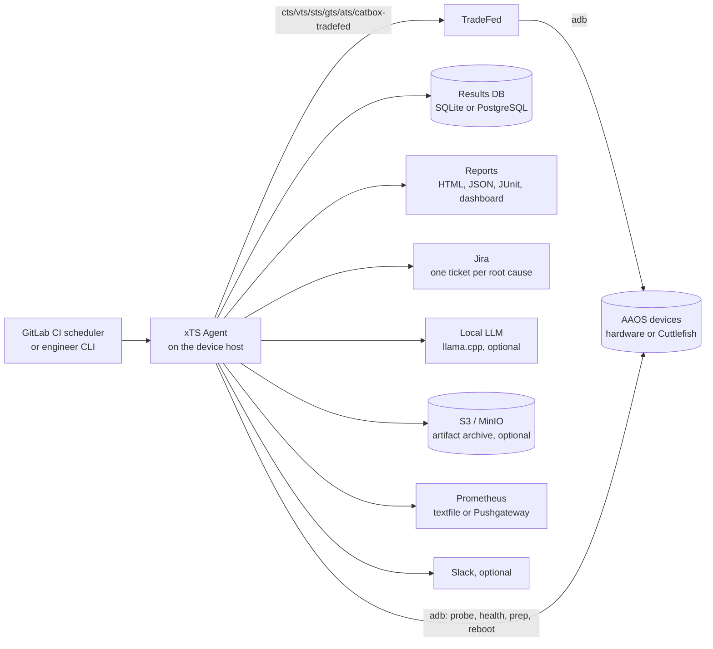
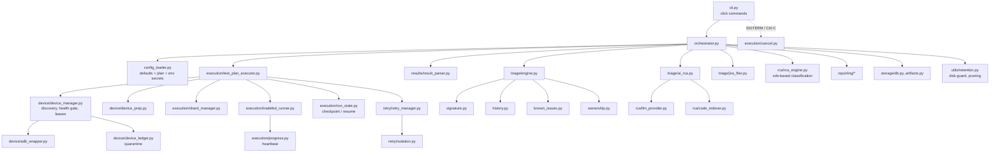
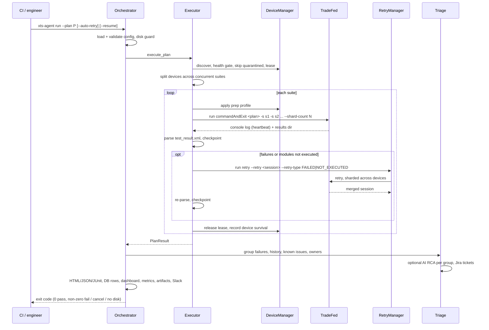
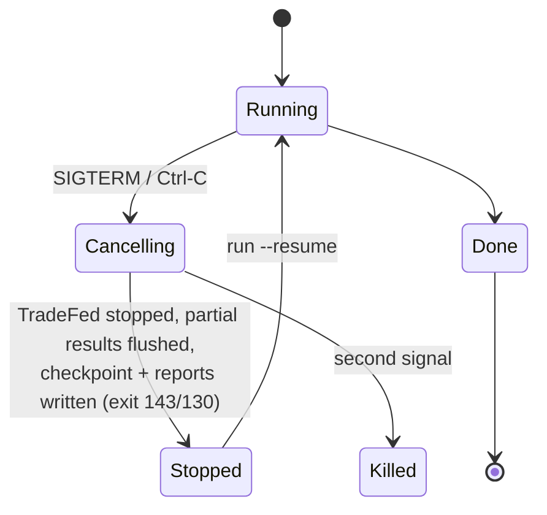
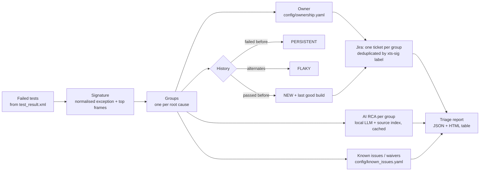
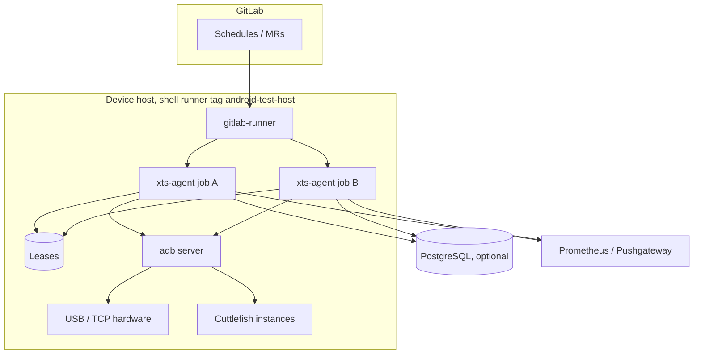

# xTS Agent architecture

This document explains how the agent is built and what happens during a run.
For the business case and how to present it, see [OEM_OVERVIEW.md](OEM_OVERVIEW.md).
For setup and commands, see the [README](../README.md).

## 1. Design principles

| Principle | What it means in practice |
|-----------|---------------------------|
| **TradeFed stays the source of truth** | The agent drives the official `*-tradefed` launchers and reads their `test_result.xml`. It never rewrites results, the launcher or the test packages, so certification output is exactly what Google's tooling produced. |
| **Certification and development are separate** | `profile: certification` plans refuse module filters at load time. Waivers and known issues only annotate reports; they never change a TradeFed result. |
| **Devices are shared safely** | Host-wide leases, a health gate, quarantine for unreliable devices, and no data wipe on physical hardware. |
| **Failures are handled as root causes, not test lines** | Thousands of failing tests become a short list of groups, each with history, owner, known-issue status and a single Jira ticket. |
| **On-prem by default** | AI RCA uses a local model unless external providers are explicitly allowed. Secrets come from the environment, never YAML. |
| **Runs are interruptible** | Graceful cancel, checkpoints after every suite and retry, and `--resume`. |
| **Everything is observable** | Heartbeat in the job log, Prometheus gauges, a rotated JSON log tagged with run id and suite. |

## 2. Context

Only the agent host needs access to the devices. Everything to the right of the agent is optional and switched on in configuration.

## 3. Components

| Package | Responsibility |
|---------|----------------|
| `cli.py` | Commands: `setup`, `run`, `retry`, `analyze`, `report`, `triage`, `dashboard`, `index-code`, `device-check`, `health-check`, `quarantine`, `cleanup`. |
| `orchestrator.py` | Runs one plan from start to finish: disk guard, execution, RCA, triage, reports, uploads, persistence, metrics, notification. |
| `config_loader.py` | Merges `default_config.yaml` with a plan, expands `${ENV}` references, applies secret environment variables, validates the certification profile and warns on unknown keys. |
| `device/` | ADB wrapper with timeouts; device discovery and build grouping; health gate (boot, battery `present`, network, storage, wakefulness, automotive feature); host-wide `flock` leases; declarative prep profile; reliability ledger and quarantine. |
| `execution/` | Plan sequencing, concurrent suites on a device split, TradeFed invocation and results-dir detection, heartbeat parsing, checkpoints, graceful cancel, optional ATS 2.0 upload. |
| `retry/` | TradeFed `run retry` on the previous session (`FAILED` or `NOT_EXECUTED`), sharded across all allocated devices, with isolation between attempts (reboot and prep on hardware; optional reset command on virtual devices). |
| `results/` | Parses `test_result.xml` (summary, modules done/total, ABI and `[instant]` test IDs, start/end, devices) and stores per-suite summaries for trends and device-hour estimates. |
| `triage/` | Failure signatures and grouping, NEW/PERSISTENT/FLAKY history, known issues and waivers, ownership routing, structured AI RCA per group, Jira filing. |
| `rca/` | Rule-based classification and pattern matching, diagnostic collection, LLM providers, local source-code index for retrieval. |
| `reporting/` | Self-contained HTML report, JSON summary, JUnit for CI, trends dashboard, Prometheus metrics, Slack. |
| `storage/` | One SQL layer for SQLite (default) and PostgreSQL; optional S3/MinIO upload. |
| `utils/` | Logging, environment validation, disk guard and retention. |

## 4. Run flow

### 4.1 End-to-end sequence

### 4.2 Step by step

1. **Load configuration.** Defaults, then the plan, then environment variables for secrets. A certification plan containing filters is rejected before any device is touched.
2. **Disk guard.** `run` and `retry` exit with code 3 if the package, results or temp filesystem has less than `ops.min_free_disk_gb`.
3. **Device allocation.**
   1. List online ADB devices.
   2. Skip quarantined ones.
   3. Run the health gate in parallel, rebooting unhealthy devices when configured.
   4. Group by build fingerprint, so one suite never shards across mixed builds.
   5. Take host-wide leases. A busy device reports who holds it (pid, user, CI job).
4. **Device split.** With `max_concurrent_suites: N`, the same-build pool is divided between the first N suites in proportion to their expected device-hours. Estimates come from past runs in the results database, or built-in estimates. When a suite finishes, its devices start the next pending suite.
5. **Preparation.** The declarative prep profile is applied before each suite: stay awake, screen timeout and lock, location, Wi-Fi join, adb install verifier off, plus any extra commands.
6. **Execution.** TradeFed runs `run commandAndExit <plan>` with one `-s <serial>` per device and `--shard-count N`. The agent tails the console log:
   - Every `ops.progress_interval_secs` it logs modules started and finished, failures so far and the module on each device.
   - It warns when TradeFed has been silent for `ops.stall_warning_mins`.
   - It finds the results directory from the log and confirms it with `list results`.
7. **Parse and checkpoint.** It parses `test_result.xml` and derives the suite status:
   - FAILED outranks INCOMPLETE.
   - Unfinished modules make a run INCOMPLETE even when nothing failed.

   The state is written to `results/run_state/<plan>.json`.
8. **Retry.** With `--auto-retry` or `post_execution.suite_retry.enabled`, TradeFed `run retry` re-runs only failed or not-executed modules from the previous session.
   - The retry is sharded across all allocated devices.
   - Isolation between attempts: reboot plus prep on hardware; optional reset command on Cuttlefish. Physical devices are never wiped.
9. **Release.** Leases are released and the ledger records whether each device survived. A device that keeps failing is quarantined for `quarantine_hours`.
10. **Triage.** See section 5.
11. **Outputs.**
    - HTML, JSON and JUnit reports.
    - Rows in the results database.
    - The trends dashboard.
    - Prometheus gauges.
    - Optional artifact upload (TradeFed's own zip is reused) and ATS 2.0 upload.
    - A Slack message.
12. **Exit code.** 0 when every suite passed. Otherwise non-zero: failures, 3 for no disk space, 143 or 130 when cancelled. CI marks the job from it.

### 4.3 Cancel and resume

On `--resume`:
- suites that already passed are skipped;
- an interrupted suite continues from its last TradeFed session with `run retry`, on devices running the same build, instead of starting again.

## 5. Triage pipeline

- **Signatures.** A signature is built from the exception type, the first message line with volatile parts removed (numbers, ids, component names, hashes), and the first stack frames above the failing test's own class. Assertion and reflection frames are skipped. Tests that fail through the same helper with the same error land in one group, even across modules. A module and its `[instant]` variant failing the same way share a group.
- **History.** Every run is recorded per test. A retry of the same invocation replaces the earlier record instead of counting twice. History can be seeded from old TradeFed results with `triage --import-history`.
- **Known issues.** Each entry matches by signature, message, test or module pattern. A waiver must have an expiry date, and it changes only the report label, never the TradeFed result.
- **Owners.** Module and package patterns in `config/ownership.yaml` map to a team, a Jira component, an assignee and watchers.
- **AI RCA.** One structured answer per group, not per test: root cause, category, confidence, suggested fix and evidence.
  - It runs on llama.cpp by default.
  - External providers are refused unless `ai_rca.allow_external_providers: true`.
  - Answers are cached by signature and model.
  - Agreement with human-classified known issues is measured, so you can decide how far to trust it.
- **Jira.**
  - One ticket per actionable group, labelled `xts-sig-<signature>`.
  - An open ticket with that label gets a comment instead of a duplicate.
  - Only NEW and NO_HISTORY groups open tickets, capped per run.
  - `mode: dry_run` writes a preview file instead of filing.

## 6. Data

| Store | Contents | Location |
|-------|----------|----------|
| TradeFed results | `test_result.xml`, logs, zip; unchanged | `/opt/xts/android-<suite>/results/`, `logs/` |
| Results database | `suite_runs` (trends, device-hour estimates), `triage_runs` / `triage_modules` / `triage_failures` (history), `ai_cache`, `run_artifacts` | SQLite at `agent.database_path`, or PostgreSQL via `XTS_DATABASE_URL` |
| Run state | Checkpoint and live heartbeat per plan | `results/run_state/<plan>.json` |
| Reports | HTML, JSON, JUnit, triage JSON, Jira preview, dashboard | `results/reports/`, `results/junit/`, `results/triage/` |
| Device ledger and leases | Consecutive failures and quarantine; `flock` lease files | `device.lease_dir` (default `/var/tmp/xts-agent/leases`) |
| Agent log | JSON lines tagged with run id and suite, rotated at 50 MB × 5 | `logs/xts_agent.log` |
| Archive (optional) | Results zip, logs, reports | S3 or MinIO bucket |

Several agent hosts can share history and trends by pointing at one PostgreSQL database.

## 7. Deployment

- **Bare metal** (recommended for hardware) or the **Docker** image built from `docker/Dockerfile`. The image runs as an unprivileged user and uses the host's adb through `network_mode: host`.
- **CI stages:**
  1. `check` (ruff, mypy, unit, golden and end-to-end tests);
  2. `setup`;
  3. `health-check`;
  4. `execute-xts`;
  5. `retry`;
  6. `analyze`;
  7. `report`.
- **Several jobs can share one host.** Leases keep them off each other's devices.
- **Dependencies** are installed from hash-checked lock files (`requirements.lock`, `requirements-dev.lock`).

## 8. Extension points

| To add | Where |
|--------|-------|
| A new suite | Install `android-<suite>/tools/<suite>-tradefed` under `paths.xts_packages_dir`, add it to `KNOWN_SUITES` in `suites/suite_registry.py`, reference it in a plan. |
| Device prep steps | The `device.prep` profile in config; `device/device_prep.py`. |
| Health checks | `device/device_manager.py`, health gate. |
| Failure patterns / classification | `config/known_failures/`, `rca/pattern_matcher.py`, `rca/failure_classifier.py`. |
| Owners and known issues | `config/ownership.yaml`, `config/known_issues.yaml` (data only, no code). |
| An LLM backend | `rca/llm_provider.py`. |
| A report or notifier | `reporting/`, called from `Orchestrator.generate_reports`. |

## 9. Quality gates

- **Static checks:** ruff (correctness rules) and mypy run in the blocking `check` stage before any device job.
- **Unit tests:** `tests/test_<area>.py`.
- **Golden tests:** `tests/test_golden.py` runs against real CTS output kept in `tests/golden/`. This is how the heartbeat miscount was caught.
- **End-to-end test:** `tests/test_e2e.py` runs the real CLI against fake `cts-tradefed` and `adb` scripts. It covers execution, retry, reports, triage, the database, leases and exit codes.
