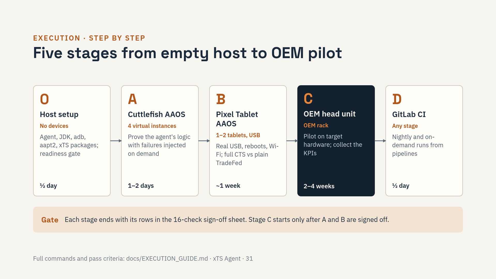

# xTS Agent: Execution Guide

This guide takes you from an empty Linux host to a validated agent running on
an OEM head unit. Follow the stages in order; each step lists the command, what
you should see, and what to do if you don't.



| Stage | Devices | Goal | Time |
|-------|---------|------|------|
| [0. Host setup](#stage-0-host-setup) | none | Install the agent, toolchain and xTS packages | ½ day |
| [A. Virtual validation](#stage-a-cuttlefish-aaos-cluster) | 4 × Cuttlefish AAOS | Prove the agent's own logic: leases, device split, retry, cancel/resume, quarantine, triage | 1–2 days |
| [B. Reference hardware](#stage-b-pixel-tablet-with-aaos) | 1–2 × Pixel Tablet with AAOS | Prove behaviour on real USB devices; first full CTS comparison | about 1 week |
| [C. OEM head unit](#stage-c-oem-head-unit) | OEM devices | Pilot on the target hardware; collect KPIs | 2–4 weeks |
| [D. CI](#stage-d-gitlab-ci) | any | Nightly and on-demand runs from GitLab | ½ day |

Record every result in the [sign-off sheet](#sign-off-sheet) at the end. Do not
start stage C until stages A and B are signed off.

Conventions used below:

```bash
cd ~/xTS-Agent && source .venv/bin/activate   # every new shell
XA="python3 -m xts_agent.cli"                 # shorthand used in this guide
CFG="--config config/default_config.yaml"
```

Exit codes of `run`: `0` passed, `1` failures remain, `3` configuration or
pre-flight error (nothing ran), `130`/`143` cancelled (Ctrl+C / SIGTERM).

---

## Stage 0: Host setup

**Host:** Ubuntu 20.04+ or Debian 11+, x86_64, at least 16 cores, 64 GB RAM and
200 GB free disk for stage A (Cuttlefish needs KVM: `ls /dev/kvm` must exist).
The agent refuses to start with less than `ops.min_free_disk_gb` (20 GB) free.

### 0.1 Clone and install system packages

```bash
git clone https://github.com/hemangpandhi/xTS-Agent.git ~/xTS-Agent
cd ~/xTS-Agent
git checkout main            # or fix/production-hardening until PR #5 is merged
sudo ./scripts/setup_environment.sh
```

`setup_environment.sh` installs OpenJDK 17, Android platform-tools (adb),
udev rules, result directories and the Python virtualenv with the
hash-pinned dependencies.

Check:

```bash
java -version          # openjdk 17
adb version
```

### 0.2 Python environment (if you skipped the setup script)

```bash
python3 -m venv .venv
source .venv/bin/activate
pip install -U pip
pip install --require-hashes -r requirements.lock
pip install --no-deps -e .
```

Optional extras: `pip install -e ".[postgres]"`, `".[s3]"`, `".[ai]"`
(the AI extra compiles llama.cpp and pulls PyTorch; skip it for stage A).

### 0.3 Android SDK build-tools (aapt2)

TradeFed needs `aapt2` to read test APKs.

```bash
export ANDROID_HOME="${ANDROID_HOME:-$HOME/Android/Sdk}"
export PATH="$PATH:$ANDROID_HOME/platform-tools:$ANDROID_HOME/build-tools/34.0.0"
which aapt2
```

Put these lines in `~/.bashrc` (or the CI runner's environment).

### 0.4 xTS packages

Download the CTS and VTS packages that match the Android version of your
builds (source.android.com for AOSP, the partner portal for GTS/ATS/CATBox)
and extract them under `/opt/xts`:

```text
/opt/xts/
├── android-cts/tools/cts-tradefed
└── android-vts/tools/vts-tradefed
```

```bash
REQUIRED_SUITES=cts,vts ./scripts/download_xts_packages.sh   # validates the layout
```

Check the module names used by the validation plans exist in your package
version (adjust `config/test_plans/validation_*.yaml` if one is missing):

```bash
/opt/xts/android-cts/tools/cts-tradefed list modules | grep -E "CtsUtil|CtsText|CtsJni|CtsCar|CtsNet"
/opt/xts/android-vts/tools/vts-tradefed list modules | grep VtsHalAutomotiveVehicle
```

### 0.5 Configure the agent

Edit `config/default_config.yaml` (keep a copy per host if hosts differ):

| Key | Set to |
|-----|--------|
| `paths.xts_packages_dir` | `/opt/xts` (default) |
| `device.lease_dir` | Same directory for every agent job on this host (default `/var/tmp/xts-agent/leases`) |
| `device.wifi_ssid` | Your test Wi-Fi (stages B and C); password via `XTS_WIFI_PASSWORD` |
| `jira.enabled` / `jira.mode` | `true` / `dry_run` for validation (writes previews only, files nothing) |
| `ops.metrics_textfile_dir` or `ops.pushgateway_url` | Optional, Prometheus |

Secrets are never written in YAML; export them in the shell or CI variables:

```bash
export XTS_WIFI_PASSWORD='...'
export XTS_JIRA_URL='https://jira.example.com' XTS_JIRA_TOKEN='...'   # only for jira.mode: live
```

Fill `config/ownership.yaml` (module → team / Jira component) and
`config/known_issues.yaml` (known failures and waivers) with your real teams
before stage C; the shipped files are starter examples.

### 0.6 Host checks

```bash
$XA setup $CFG
./scripts/preflight.sh
STRICT_DEVICES=0 REQUIRED_SUITES=cts,vts ./scripts/check_ready.sh
```

Pass: `setup` prints no errors, `preflight.sh` shows aapt2, packages and the
agent import as OK, and `check_ready.sh` ends with `RESULT: READY`
(`STRICT_DEVICES=0` because no devices are connected yet).

---

## Stage A: Cuttlefish AAOS cluster

Purpose: prove the agent's own behaviour with failures you can inject on
demand. Results are not valid for certification.

### A.1 Build and start 4 AAOS instances

You need an AOSP tree with a built `aosp_cf_x86_64_auto` target (or the
prebuilt Cuttlefish host package and images from ci.android.com).

```bash
export AOSP_ROOT=/path/to/aosp
export LUNCH_TARGET=aosp_cf_x86_64_auto-userdebug   # AAOS image, not the phone default
export CVD_HOME=/tmp/cvd_cluster_home
./scripts/start_cluster.sh 4
adb devices -l
```

Pass: four devices in state `device`, serials `0.0.0.0:6520` … `0.0.0.0:6523`.
On newer AOSP branches the lunch target includes a release, for example
`aosp_cf_x86_64_auto-trunk_staging-userdebug`.

### A.2 Enable the Cuttlefish reset hook

`FULLY_ISOLATED` retries wipe a virtual device between attempts. Physical
devices are never wiped. Set in `config/default_config.yaml`:

```yaml
device:
  virtual_reset_command: "scripts/cvd_reset.sh {serial}"
```

Test the serial-to-instance mapping without touching anything:

```bash
DRY_RUN=1 scripts/cvd_reset.sh 0.0.0.0:6522
# Resetting 0.0.0.0:6522 (instance 3): cvd powerwash --instance_num=3
```

The script refuses serials that are not `host:port`, so it can never act on a
USB device. Export `CVD_HOME` in the shell that runs the agent.

### A.3 Device checks

```bash
$XA device-check --plan config/test_plans/validation_virtual.yaml $CFG --min-devices 4
$XA health-check --plan config/test_plans/validation_virtual.yaml $CFG
```

Pass: 4 devices found, all healthy (battery, storage, boot completed). If
the host gives Cuttlefish no internet access you get a "no validated internet"
warning; that only affects network tests and is fine for stage A.

### A.4 Dry run

```bash
$XA run --plan config/test_plans/validation_virtual.yaml $CFG --dry-run
```

Pass: the plan loads with no unknown-key warnings and the log shows one
`DRY RUN command:` line per suite: the exact `cts-tradefed` / `vts-tradefed`
command with include filters, retry and sharding options. A dry run does not
touch adb; it uses placeholder serials and runs suites one after another.

### A.5 Scenario 1: normal concurrent run

```bash
$XA run --plan config/test_plans/validation_virtual.yaml $CFG --auto-retry 2>&1 | tee stageA_run1.log
echo "exit=$?"
```

What happens: CTS and VTS start at the same time on a split of the 4 devices
(`max_concurrent_suites: 2`); a heartbeat line appears every 10 minutes; failed
tests are retried with `run retry`; then triage and reports run.

Pass:
- both suites started in parallel and no serial is used by both;
- `results/reports/xts_report_*.html` opens and shows both suites;
- `results/triage/` contains groups; `CtsCarTestCases` failures are routed to
  `aaos-car-framework` by `ownership.yaml`;
- `results/triage/jira_preview_*.json` lists one proposed ticket per group;
- exit code is `0` or `1` (failures are fine here; `3` is not).

### A.6 Scenario 2: cancel and resume

```bash
$XA run --plan config/test_plans/validation_virtual.yaml $CFG --auto-retry &
AGENT=$!
# wait until both suites are running (watch the log), then:
kill -TERM $AGENT; wait $AGENT; echo "exit=$?"     # expect 143
pgrep -af tradefed || echo "no TradeFed left"      # expect none
cat results/run_state/*.json | head -40             # checkpoint written
$XA run --plan config/test_plans/validation_virtual.yaml $CFG --auto-retry --resume
```

Pass: the cancel exits with `143`, logs "Run cancelled; resume with
`xts-agent run --resume`" and leaves no TradeFed process (a second signal
kills TradeFed immediately). The resumed run logs `Resuming <plan>`, skips
passed suites (`Resume: <suite> already PASSED ...; skipping`) and continues
the interrupted suite with `run retry` instead of starting it again.

### A.7 Scenario 3: two jobs on one rack (leases)

Terminal 1:

```bash
$XA run --plan config/test_plans/validation_virtual.yaml $CFG
```

Terminal 2, while terminal 1 is running:

```bash
$XA run --plan config/test_plans/smoke_test.yaml $CFG
ls -l /var/tmp/xts-agent/leases/
```

Pass: the second job never starts on a serial the first job holds. Either it
gets a free device or it stops with a message naming the holder (pid, user,
CI job). The lease files are named after the serials (`0.0.0.0_6520.lock`).

### A.8 Scenario 4: a device drops out (quarantine and recovery)

Start scenario 1 again, and while CTS is running take one instance offline:

```bash
adb disconnect 0.0.0.0:6523
# ... wait until TradeFed/the agent log reports the device offline, then:
adb connect 0.0.0.0:6523
```

Repeat in three separate runs (or until the agent reports it), then:

```bash
$XA quarantine --plan config/test_plans/validation_virtual.yaml $CFG
$XA quarantine --plan config/test_plans/validation_virtual.yaml $CFG --release 0.0.0.0:6523
```

Pass: the run finishes on the remaining devices; after 3 consecutive failures
the device is listed as quarantined (24 h by default) and skipped by the next
run; `--release` returns it to the pool.

### A.9 Scenario 5: isolated retry with reset

In scenario 1's log, find the CTS retry. With `isolation_grade:
FULLY_ISOLATED` and the reset hook set, the log shows
`Resetting virtual device 0.0.0.0:65xx: cvd powerwash --instance_num=N`,
followed by device prep and the retry.

Pass: the instance comes back, prep runs, and the retry completes.

### A.10 Scenario 6: triage history

Run scenario 1 twice more. Then:

```bash
$XA triage --plan config/test_plans/validation_virtual.yaml $CFG --top 15
```

Pass: groups seen in every run are labelled `PERSISTENT`, groups in only some
runs `FLAKY`, and new ones `NEW`. Jira previews propose new tickets only for
`NEW`/`NO_HISTORY` groups and comments for the rest.

### A.11 Clean up

```bash
$XA cleanup --plan config/test_plans/validation_virtual.yaml $CFG --kill-tradefed
HOME=$CVD_HOME stop_cvd || HOME=$CVD_HOME cvd stop
```

---

## Stage B: Pixel Tablet with AAOS

Purpose: real USB, real reboots, real Wi-Fi and screen-lock behaviour, and the
first full CTS pass compared against plain TradeFed.

### B.1 Build and flash

1. Download the vendor binaries for Pixel Tablet (`tangorpro`) matching your
   AOSP build from the Google driver binaries page and extract them into the
   AOSP tree.
2. Build the AAOS target:

   ```bash
   source build/envsetup.sh
   lunch aosp_tangorpro_car-trunk_staging-userdebug   # name varies by branch
   m
   ```

3. Unlock the bootloader once, then flash:

   ```bash
   adb reboot bootloader
   fastboot flashall -w
   ```

4. On the tablet: finish setup, enable Developer options and USB debugging,
   connect to the host by USB, accept the RSA prompt ("Always allow").

Use `userdebug` for validation. A certification submission needs the OEM's
`user` build (stage C).

### B.2 Device checks

```bash
adb devices -l                                  # serial, state "device"
adb shell pm list features | grep automotive   # android.hardware.type.automotive
$XA device-check --plan config/test_plans/validation_hardware.yaml $CFG --min-devices 1
$XA health-check --plan config/test_plans/validation_hardware.yaml $CFG
```

Pass: the tablet is detected as an AAOS device (the plan requires
`device_type: aaos`; a phone image is rejected), battery and storage pass, and
the network is validated once `wifi_ssid` is set.

Keep the tablet on its charger: devices below `min_battery_level` (20 %) are
skipped.

### B.3 Subset run

```bash
$XA run --plan config/test_plans/validation_hardware.yaml $CFG --auto-retry 2>&1 | tee stageB_subset.log
```

Pass:
- device prep ran (log: stay awake, screen lock off, location, Wi-Fi joined,
  install verifier off) and the screen stayed on for the whole run;
- `CtsNetTestCases` ran with network (no mass "no internet" failures);
- retries rebooted the tablet (`REBOOT_ISOLATED`) and never wiped it;
- reports and triage as in A.5.

### B.4 Cancel, resume and unplug

Repeat A.6 on the tablet. Then start a run and unplug the USB cable for
2 minutes during CTS.

Pass: the device is reported offline in the log, the run ends cleanly with a
non-zero exit code, no TradeFed process is left, and `--resume` continues the
suite after you plug it back in.

### B.5 Full CTS, agent versus plain TradeFed

Run the full CTS twice on the same build: once with plain TradeFed, once with
the agent.

```bash
# 1. Plain TradeFed (baseline)
/opt/xts/android-cts/tools/cts-tradefed run commandAndExit cts -s <serial>

# 2. Agent
$XA run --plan config/test_plans/full_cts_hardware.yaml $CFG --auto-retry 2>&1 | tee stageB_full.log
```

Compare:

| Measure | Where |
|---------|-------|
| Pass / fail / not-executed counts | Each run's `test_result.xml` (under `/opt/xts/android-cts/results/`) |
| Wall-clock time | Start and end of each run |
| Failures after retry | Agent report vs plain run |
| Failure groups to read | `results/triage/` vs raw failing tests |

Pass: the agent's `test_result.xml` is a normal TradeFed result (the agent
does not modify it); counts are equal or better after retry, and any
difference is explained by retries, not by missing modules. The certification
profile refuses to start if a module filter is set, so a "green" agent run is
always a complete run.

---

## Stage C: OEM head unit

Purpose: run on the target hardware and measure the pilot KPIs
([OEM_OVERVIEW.md §8](OEM_OVERVIEW.md#8-measuring-the-benefit-in-a-pilot)).

### C.1 Before you start

- [ ] Stages A and B signed off.
- [ ] `ownership.yaml` filled with the OEM's real teams and Jira components.
- [ ] `known_issues.yaml` holds the OEM's known failures and waivers (with expiry dates).
- [ ] Test Wi-Fi reachable from the head units; `wifi_ssid` and `XTS_WIFI_PASSWORD` set.
- [ ] OEM-specific settings that block tests (demo mode, setup wizard, driver
      distraction, user-switch prompts) added to `device.extra_commands`.
- [ ] Jira stays in `dry_run` until the OEM reviews the previews.
- [ ] Two weeks of baseline numbers without the agent recorded (or past
      `test_result.xml` dirs available for `triage --import-history`).

### C.2 Connect the rack

USB through a powered hub, or adb over the network:

```bash
adb connect 192.168.1.10:5555
adb connect 192.168.1.11:5555
adb devices -l
STRICT_DEVICES=1 MIN_DEVICES=2 REQUIRED_SUITES=cts ./scripts/check_ready.sh   # RESULT: READY
```

If `adb shell pm list features` on the head unit does not list
`android.hardware.type.automotive`, set `devices.device_type: any` in the plan and pin devices with
`devices.properties` (for example `ro.product.model`).

### C.3 Seed history (optional, recommended)

```bash
$XA triage --plan config/test_plans/cts_only.yaml $CFG \
  --import-history /path/to/old/results/2026.09.01_10.00.00 \
  --import-history /path/to/old/results/2026.09.08_10.00.00
```

The first agent run then labels failures as `PERSISTENT` or `NEW` instead of
`NO_HISTORY`.

### C.4 Progression

| Step | Command | Pass |
|------|---------|------|
| 1. Smoke | `$XA run --plan config/test_plans/smoke_test.yaml $CFG` | Runs end to end on one head unit |
| 2. Subset on all units | `$XA run --plan config/test_plans/validation_hardware.yaml $CFG --auto-retry` | Shards across all units; prep holds |
| 3. Dev nightly | `$XA run --plan config/test_plans/dev_cts_hardware_triage.yaml $CFG --auto-retry` | Stable for a week |
| 4. Full CTS | `$XA run --plan config/test_plans/cts_only.yaml $CFG --auto-retry` | Complete result, matches plain TradeFed |
| 5. Full certification | `$XA run --plan config/test_plans/full_certification.yaml $CFG --auto-retry` | All suites, all modules |

Long runs: run them from CI or inside `tmux`, and use `--resume` after any
interruption.

### C.5 Go live with Jira

After the OEM has reviewed `results/triage/jira_preview_*.json` from a few
runs, set `jira.mode: live`, `jira.project`, the auth settings and
`XTS_JIRA_TOKEN`. The agent files at most `max_new_issues_per_run` (20) tickets
per run, one per failure group, and comments on the open ticket when a group
comes back.

---

## Stage D: GitLab CI

```bash
export GITLAB_URL="https://gitlab.example.com/"
export REGISTRATION_TOKEN="..."
sudo ./scripts/setup_gitlab_runner.sh
```

The runner uses the shell executor with the tag `android-test-host`, so jobs
see the host's adb and devices. Pipeline stages: check → setup → health-check →
execute-xts → retry → analyze → report. Set these CI/CD variables:

| Variable | Example |
|----------|---------|
| `TEST_PLAN` | `config/test_plans/cts_only.yaml` |
| `DEVICE_MIN_COUNT` | `2` |
| `XTS_PACKAGES_DIR` | `/opt/xts` |
| `XTS_WIFI_PASSWORD`, `XTS_JIRA_TOKEN`, `XTS_SLACK_WEBHOOK` | masked variables |

Cancelling a pipeline sends SIGTERM: the agent stops TradeFed, writes the
checkpoint, and the next pipeline can run with `--resume`.

---

## Reading the results

| What | Where |
|------|-------|
| Summary report (start here) | `results/reports/xts_report_*.html` |
| Failure groups, history labels, owners, AI hints | `results/triage/` |
| Proposed or filed Jira tickets | `results/triage/jira_preview_*.json` |
| Trends across runs | `results/reports/dashboard.html` (`$XA dashboard --plan P $CFG`) |
| Checkpoint and live progress | `results/run_state/<plan>.json` |
| JUnit for CI | `results/junit/` |
| TradeFed console logs | `results/logs/` |
| Official TradeFed results (submission) | `/opt/xts/android-<suite>/results/` |
| Agent log | `logs/xts_agent.log` |

Regenerate without rerunning tests:

```bash
$XA analyze --plan P $CFG --rca --classify-failures
$XA report  --plan P $CFG --format html,json,junit
```

---

## Troubleshooting

| Symptom | Cause and fix |
|---------|---------------|
| `run` exits with `3` | Configuration or pre-flight error; the message names the key or the missing tool. Fix it and rerun. |
| "is profile: certification but restricts the test set" | A `profile: certification` plan has filters; move the filters to a development plan. |
| No devices allocated, "leased by …" | Another job holds them; wait, or stop that job. Stale leases are released automatically when the holding process exits. |
| Device skipped as quarantined | `$XA quarantine --plan P $CFG`; fix the device, then `--release SERIAL`. |
| "Skipping <serial>: battery N% < 20%" | Charge the device or lower `device.min_battery_level` for bench devices without batteries. |
| Many network test failures | Device not on validated Wi-Fi; set `wifi_ssid`/`XTS_WIFI_PASSWORD` and check `health-check`. |
| `AaptParser` / aapt2 errors | `aapt2` not on `PATH`; see 0.3 and run `./scripts/preflight.sh`. |
| "TradeFed log silent for …: possible hang" warning | Likely a wedged device; check the device, cancel and `--resume`. |
| Leftover TradeFed after a crash | `$XA cleanup --plan P $CFG --kill-tradefed` (only kills processes the agent started). |
| Disk full | `$XA cleanup --plan P $CFG --prune-results --keep-days 14 --dry-run`, then without `--dry-run`. |
| Cuttlefish reset fails | Run `DRY_RUN=1 scripts/cvd_reset.sh <serial>`; check `CVD_HOME` and that `cvd` or `powerwash_cvd` is on `PATH`. |

---

## Sign-off sheet

Copy this table into your tracking ticket and fill it in.

| # | Check | Stage | Result | Notes / run id |
|---|-------|-------|--------|----------------|
| 1 | Host checks: `check_ready.sh` READY | 0 | | |
| 2 | Concurrent CTS + VTS, no shared serial | A.5 | | |
| 3 | Reports, triage, owners, Jira preview produced | A.5 | | |
| 4 | Cancel → exit 143, no TradeFed left, resume continues | A.6 | | |
| 5 | Second job never shares a leased device | A.7 | | |
| 6 | Dropped device: run completes, quarantine after 3, release works | A.8 | | |
| 7 | Virtual reset before isolated retry | A.9 | | |
| 8 | History labels NEW / PERSISTENT / FLAKY correct | A.10 | | |
| 9 | Tablet detected as AAOS, health and Wi-Fi OK | B.2 | | |
| 10 | Prep holds for the whole run; retries reboot, never wipe | B.3 | | |
| 11 | Unplug: clean failure, resume works | B.4 | | |
| 12 | Full CTS: agent result complete and consistent with plain TradeFed | B.5 | | |
| 13 | Smoke and subset on OEM head units | C.4 | | |
| 14 | One week of stable nightlies | C.4 | | |
| 15 | Full CTS on OEM units; KPIs recorded | C.4 | | |
| 16 | Jira previews reviewed and live mode approved | C.5 | | |
