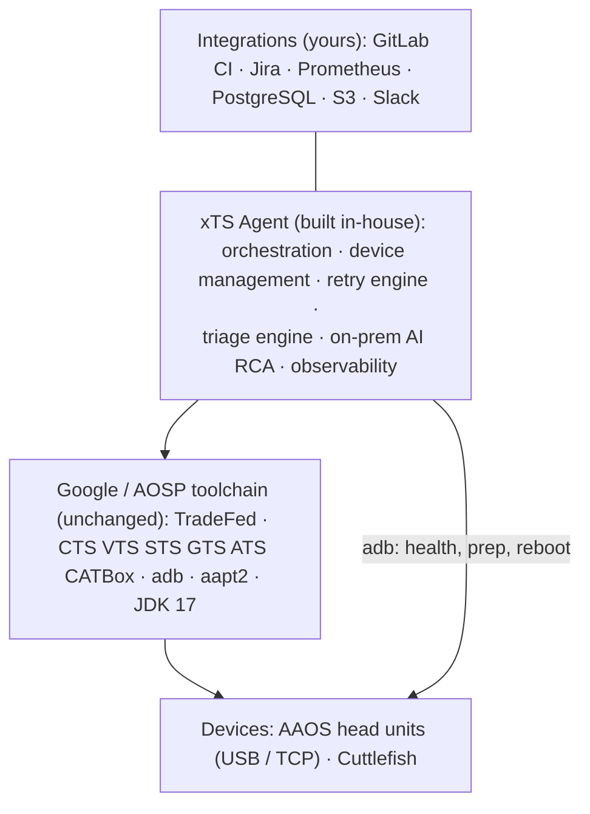
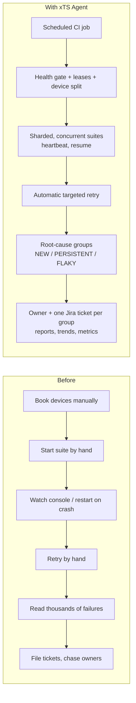

# xTS Agent for OEM programs

A guide to explaining the agent to an OEM: what problem it solves, what it changes in the daily xTS workflow, what it does *not* do, and how to measure the benefit.
Technical detail is in [ARCHITECTURE.md](ARCHITECTURE.md).

## 1. The problem

Getting an Android Automotive head unit through CTS, VTS, STS, GTS and the automotive suites is mostly operational work, not test writing:

| Pain today | Typical cause |
|------------|---------------|
| Full runs take days and often have to be restarted | Sequential suites, a device drops offline, the host reboots, a CI job is cancelled |
| Devices sit idle or get double-booked | Manual scheduling, several engineers or jobs on one rack |
| Results can't be trusted at a glance | Modules silently not executed, mixed builds in one shard, flaky devices |
| Triage takes longer than execution | Thousands of failing test lines, most of them a few dozen underlying bugs |
| The same bug is filed many times, or never | No link between failure history, owners and the issue tracker |
| No view of quality over time | Results live in per-session folders on one machine |

## 2. What the agent is

A command-line tool and CI integration that sits **around** Google's official TradeFed launchers. It:

1. allocates healthy devices safely;
2. runs and shards the suites;
3. recovers from interruptions;
4. retries only what failed;
5. turns the raw results into a short, owned, ticketed list of root causes, with reports and trends.

It does **not** modify TradeFed, the test packages or `test_result.xml`. What you submit for certification is exactly what the official tools produced.

## 3. The harness and what is ours

- **Google and AOSP provide the test content and the runner:** the xTS suites, TradeFed, adb and aapt2. The agent uses them unchanged, so results stay valid for certification.
- **Open-source libraries** (Python, click, Jinja2, SQLite and others, all pinned and hash-checked) are the building blocks.
- **The agent's own code is the differentiator.** It covers everything between "TradeFed can run a suite" and "the OEM ships with known, owned, tracked failures":

| Built in-house | Unique benefit to the OEM |
|----------------|---------------------------|
| Device management: health gate, host-wide leases, quarantine, same-build pools, prep profile | A shared rack that stays reliable without a person babysitting it |
| Orchestration: certification profile, concurrent suites sized by history, checkpoint and `--resume`, graceful cancel | Shorter cycles; interruptions no longer cost a restart; filtered runs can't reach submission |
| Retry engine: targeted `run retry`, sharded on all devices, no wipe on hardware | Retries finish faster and don't shrink the farm |
| Result integrity and live progress: completeness gate, results-dir detection, TradeFed console heartbeat | A green result means a complete run; hangs are visible within the hour |
| Triage engine: failure signatures, NEW / PERSISTENT / FLAKY history, expiring waivers, ownership routing, deduplicated Jira | 1,303 failures → 183 owned root causes in our lab run; regressions surface first; no duplicate tickets |
| On-prem AI RCA with retrieval over OEM source, measured against human classification | Root-cause hints without sending code or logs outside |
| Observability: offline HTML report, trends dashboard, Prometheus metrics | One page per run and trends over time for management |
| Quality harness: golden tests on real CTS output, end-to-end CLI test | Changes to the agent are checked before they touch a device |

A side-by-side of "Google tooling alone vs with the agent", and the full technology stack, are in [ARCHITECTURE.md §3](ARCHITECTURE.md#3-the-harness-layers-and-technology-stack).

## 4. The workflow, before and after

## 5. Benefits

### 5.1 Faster execution

- **All devices busy.** Each suite is sharded across every healthy device on the same build. With `max_concurrent_suites`, several suites run in parallel on a split sized by their measured device-hours. When a suite finishes, its devices move straight to the next one.
- **Retries only re-run what failed.** TradeFed `run retry` targets failed or not-executed modules and is sharded across all allocated devices, not one.
- **No restarting from zero.** Progress is checkpointed after every suite and retry. After a host reboot or a cancelled job, `run --resume` skips passed suites and continues interrupted ones from their last session.
- **Parallel device work.** Probing, health checks and reboots run concurrently.

### 5.2 Trustworthy results

- **Certification profile.** Plans marked `certification` cannot carry module filters, so a filtered run can never be passed off as a full one.
- **Incomplete runs are flagged.** A run is marked INCOMPLETE when modules were not executed, even if nothing failed.
- **One build per shard.** A suite only shards across devices running the same build fingerprint.
- **No hidden result changes.** Known issues and waivers only annotate the report. Waivers must have an expiry date.
- **Physical devices are never wiped** between retries, so the farm doesn't silently shrink (lost ADB keys, Wi-Fi, setup state).

### 5.3 A device farm that runs itself

- **Health gate before allocation:** boot completed, battery, network, storage, wakefulness, automotive feature.
- **Host-wide leases:** concurrent CI jobs and manual runs never share a device, and a busy device says who holds it.
- **Quarantine:** devices that keep failing are set aside for 24 hours and listed by `xts-agent quarantine`.
- **Declarative prep profile:** the same device setup before every suite.

### 5.4 Faster triage and issue resolution

The largest saving. Measured on a real CTS 17_r2 run in this lab (11 Cuttlefish devices, 2.4 hours, 163,264 tests executed, 99.2% pass rate):

| | Count |
|---|---|
| Failing tests | 1,303 |
| Modules with failures | 85 |
| **Root-cause groups after signature grouping** | **183** |
| Failures in the largest group | 413 (one issue) |
| Failures covered by the top 10 groups | 746 (57%) |

For each group the agent adds:

| Field | What it tells the engineer |
|-------|----------------------------|
| History | **NEW** (regression, with the last passing build), **PERSISTENT**, **FLAKY**, or no history yet |
| Known issue / waiver | Already understood, and until when |
| Owner | Team, Jira component and assignee, from a YAML map you control |
| Jira | One ticket per root cause; recurring failures add a comment instead of a duplicate |
| AI RCA (optional) | Suggested root cause, category, confidence, fix direction and evidence, from a **local** model with your source code indexed. External providers are off by default. |

Engineers start from about 180 owned problems sorted by size and novelty, instead of 1,300 test lines.

### 5.5 Visibility for management

- **One page per run:** a self-contained HTML report (works offline and can be attached anywhere), plus JSON and JUnit (failures show in GitLab merge requests).
- **Trends dashboard** from the results database: pass rate, duration and failures per suite over time.
- **Live status:** a heartbeat in the job log and Prometheus gauges (run in progress, quiet TradeFed, tests by result, quarantined devices) with suggested alerts.
- **Multi-site:** several hosts can share one PostgreSQL history.

### 5.6 Fit for an OEM production environment

| Concern | How it is handled |
|---------|-------------------|
| Data confidentiality | On-prem AI by default; external LLMs need an explicit opt-in. Logs and source never leave the host otherwise. |
| Secrets | Read from environment / CI masked variables, never YAML; the loader warns on plaintext. |
| Supply chain | Hash-pinned dependency locks; Docker image runs as an unprivileged user; checksum-verified SDK tools. |
| Operations | Graceful cancel, disk-space guard, results retention, rotated JSON logs tagged with run id. |
| Change safety | Blocking CI gate (lint, type check, unit, golden tests on real CTS output, end-to-end test) before any device job runs. |
| Infrastructure | Runs on bare metal or Docker on the existing device host; GitLab CI as scheduler; SQLite needs no server. |

## 6. What it does not do (yet)

Set expectations honestly:

- **No device flashing.** Devices must already run the build under test.
- **No test selection from code changes.** Plans choose the modules; change-based selection is planned.
- **No certification decisions.** It doesn't submit to Google or decide pass/fail for certification; TradeFed results remain authoritative.
- **AI RCA is advisory.** Its agreement with human-classified known issues is measured so you can decide how much to rely on it.
- **ATS 2.0 upload is experimental.**

## 7. How to present it (talk track)

1. **Start with their pain.** Ask how long a full certification cycle takes, how often runs are restarted, and how many engineer-days triage takes per drop.
2. **Show a real report.** Open the HTML report and the triage table from a run on their hardware: 1,303 failures shown as 183 owned groups, NEW ones on top.
3. **Explain the safety.** Official TradeFed, results untouched, certification profile, on-prem AI.
4. **Show operations.** Kill a run mid-way, then `--resume`. Show the heartbeat, the quarantine list and the dashboard.
5. **Agree a pilot and the numbers to measure** (section 8).

## 8. Measuring the benefit in a pilot

Measure before and after on the same hardware and builds. All figures below come from data the agent already records.

| KPI | Source |
|-----|--------|
| Wall-clock time per full suite / per plan | `suite_runs` table, HTML report |
| Device utilisation (device-hours used / available) | `suite_runs` duration × devices |
| Runs restarted from zero vs resumed | CI job history, `--resume` invocations |
| Failing tests vs root-cause groups per run | triage JSON `summary` |
| Time from failure to ticket with owner | Jira ticket created timestamps vs run end |
| Duplicate tickets | Jira tickets per `xts-sig-*` label |
| Regressions caught (NEW groups) and flaky tests | triage history |
| AI RCA agreement with human classification | triage JSON `summary.ai_agreement` |

**Suggested pilot:** 2–4 weeks on one head-unit program.
1. Import historical results first (`triage --import-history`).
2. Run Jira in `dry_run` mode for the first week.
3. Fill in `config/ownership.yaml` with the OEM's teams.

## 9. Rollout steps

1. Install on the existing device host (bare metal or Docker). See the [README](../README.md).
2. Put xTS packages under `/opt/xts`. Run `scripts/preflight.sh` and `scripts/check_ready.sh`.
3. Run the smoke plan, then a development CTS plan.
4. Seed history from past results. Fill in the ownership and known-issues files.
5. Connect GitLab CI (shell runner tagged `android-test-host`) and schedule nightly runs.
6. Turn on Jira (dry run, then live), Prometheus alerts and, optionally, PostgreSQL, the artifact archive and local AI RCA.
7. Use `certification` profile plans for submission runs.

## 10. FAQ

**Does it change CTS results?**
No. It reads TradeFed's output; waivers only annotate the agent's own reports.

**Can it run on our real head units, not only emulators?**
Yes. Use USB or TCP ADB devices with the hardware plans (`cts_only.yaml`, `full_cts_hardware.yaml`). Cuttlefish is supported for virtual farms.

**Does any data leave our network?**
Not by default. Jira, Slack, S3 and external LLMs are only used if you configure them, and external LLMs need an explicit flag.

**What if two teams use the same rack?**
Leases prevent sharing. The second job waits, or fails with the name of the holder.

**What happens if the host reboots during a 2-day run?**
Rerun the same command with `--resume`. Finished suites are skipped, and the interrupted one continues from its last session.

**What do we need to maintain?**
The ownership and known-issues YAML files, test plans, and the xTS packages. The code itself is covered by a blocking CI check.
